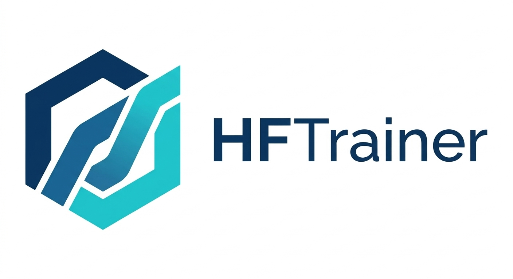

<div align="center">



# HF-Trainer

**Config-driven training for HuggingFace-native models, built on `accelerate`.**

One shared task core for training and inference, native `transformers` / `diffusers` / `peft` integration, and per-module control from config.

<p>
  <a href="docs/en/index.md"><strong>Documentation</strong></a> •
  <a href="docs/en/quickstart.md"><strong>Quick Start</strong></a> •
  <a href="docs/en/integration.md"><strong>Integration</strong></a> •
  <a href="docs/en/api_reference.md"><strong>API Reference</strong></a> •
  <a href="docs/en/tasks.md"><strong>Task Matrix</strong></a> •
  <a href="https://github.com/ZeyuLing/HFTrainer/issues"><strong>Issues</strong></a>
</p>

<p>
  <a href="docs/en/index.md">English Docs</a> |
  <a href="docs/zh-cn/index.md">简体中文文档</a>
</p>

<p>
  
  
  
  
</p>

</div>

## Why HF-Trainer

HF-Trainer is for teams that like MMEngine-style `.py` configs, but want the runtime behavior, model ecosystem, and export path of HuggingFace instead of another custom engine.

It is built for a specific workflow:

- keep experiment configuration declarative
- keep model classes and inference artifacts HuggingFace-native
- avoid writing one copy of task logic for training and another for inference
- fine-tune large models with per-module freeze, LoRA, dtype, and checkpoint control

## What You Get

| You want | HF-Trainer gives you |
| --- | --- |
| reproducible experiments instead of ad-hoc scripts | MMEngine-style `.py` configs and registry-based construction |
| native large-model runtime behavior | `accelerate` for DDP, FSDP, DeepSpeed, mixed precision, logging, and state save/load |
| direct use of HuggingFace components | native `transformers`, `diffusers`, and `peft` classes without framework-specific wrapper semantics |
| one place to implement task logic | `ModelBundle` shared by `Trainer` and `Pipeline` |
| memory-aware fine-tuning | config-driven freeze, LoRA, per-module dtype, gradient checkpointing, and accumulation |
| reliable restart and export | `auto_resume`, model-only load, full accelerator resume, and task-native `save_pretrained(...)` |

## Runnable Today

| Task | Core Stack | Demo Config | Status |
| --- | --- | --- | --- |
| Classification | `ViTBundle` + `ClassificationTrainer` + `ClassificationPipeline` | `configs/classification/vit_base_demo.py` | verified |
| Text-to-image | `SD15Bundle` + `SD15Trainer` + `SD15Pipeline` | `configs/text2image/sd15_demo.py` | verified |
| Causal LM SFT | `CausalLMBundle` + `CausalLMTrainer` + `CausalLMPipeline` | `configs/llm/llama_sft_demo.py` | verified |
| Causal LM LoRA | `CausalLMBundle` + `CausalLMTrainer` + `CausalLMPipeline` | `configs/llm/llama_lora_demo.py` | verified |
| Text-to-video | `WanBundle` + `WanTrainer` + `WanPipeline` | `configs/text2video/wan_demo.py` | verified |
| Motion generation (PRISM) | `PrismBundle` + `PrismTrainer` + `PrismPipeline` | `configs/motion/prism_demo.py` | verified reference |
| Motion generation / understanding (VerMo) | `VermoBundle` + `VermoTrainer` + `VermoPipeline` | `configs/motion/vermo_demo.py` | verified reference |
| GAN | `StyleGAN2Bundle` + `GANTrainer` + `StyleGAN2Pipeline` | `configs/gan/gan_demo.py` | verified reference |
| DMD | `DMDBundle` + `DMDTrainer` + `DMDPipeline` | `configs/distillation/dmd_demo.py` | verified reference |

`verified reference` means the training / inference path is smoke-validated and runnable, but the default project is positioned as a framework reference implementation rather than a benchmark-tuned reproduction.

## Installation

```bash
pip install -e .
```

Prepare local demo assets:

```bash
bash tools/download_checkpoints.sh
python3 tools/download_demo_data.py --task all
```

## Get Started

Run the simplest verified training path:

```bash
python3 tools/train.py configs/classification/vit_base_demo.py
```

Run the verified LoRA path:

```bash
python3 tools/train.py configs/llm/llama_lora_demo.py
python3 tools/infer.py \
  --config configs/llm/llama_lora_demo.py \
  --checkpoint work_dirs/llama_lora_smoke/checkpoint-iter_10 \
  --merge-lora \
  --prompt "Name one primary color."
```

Run distributed training:

```bash
bash tools/dist_train.sh configs/text2video/wan_demo.py 8
```

Run the startup smoke suite:

```bash
python3 -m pytest -m smoke tests/smoke/test_task_startup.py
```

The smoke suite uses reduced temporary configs to verify that each task stack can start training and inference through the real CLI entry points.

## Core Design

HF-Trainer keeps the framework surface small:

- `AccelerateRunner` builds the full runtime from one config and owns the loop
- `ModelBundle` holds task sub-modules and shared atomic forward functions
- `Trainer` assembles training-time control flow and optimization
- `Pipeline` assembles inference-time control flow without duplicating task internals

This is the main reason the project exists: training and inference stay aligned without forcing users into a non-HuggingFace inference API.

## Memory Control From Config

Supported today:

- global AMP via `accelerator.mixed_precision='no'|'fp16'|'bf16'`
- per-module loader dtype via `from_pretrained.torch_dtype` or `dtype`
- per-module post-load cast via `module_dtype='fp32'|'fp16'|'bf16'`
- activation memory reduction via `gradient_checkpointing=True`
- optimizer/state reduction via `trainable=False`, `trainable='lora'`, and `accelerator.gradient_accumulation_steps`

Important caveat:

- if you need a strict policy like `vae=fp32` and `transformer=bf16`, prefer per-module dtype settings and keep `accelerator.mixed_precision='no'`
- global AMP can still autocast eligible ops on top of module weights

See:

- [English Memory and Precision Guide](docs/en/memory.md)
- [简体中文 显存与精度指南](docs/zh-cn/memory.md)

## Integration Paths

HF-Trainer exposes two clear ways to adopt the framework:

| Starting point | What you implement | What stays HuggingFace-native |
| --- | --- | --- |
| an existing `transformers` / `diffusers` model | a task bundle plus task training logic | `from_pretrained`, official component classes, tokenizer / processor, and exported inference artifact |
| a custom or self-developed model | your own `nn.Module` plus a task bundle | config-driven construction, checkpointing, hooks, runner, and optional custom `save_pretrained` |

Rule of thumb:

- if HuggingFace already has the model class, keep the official class inside the bundle and only add training wiring
- if HuggingFace does not have the model class, use `ModelBundle.from_config(...)` and add `from_pretrained/save_pretrained` only when you need a stable exported artifact

## Documentation

| Topic | English | 简体中文 |
| --- | --- | --- |
| Docs Home | [Home](docs/en/index.md) | [首页](docs/zh-cn/index.md) |
| Installation | [Installation](docs/en/installation.md) | [安装说明](docs/zh-cn/installation.md) |
| Quick Start | [Quick Start](docs/en/quickstart.md) | [快速开始](docs/zh-cn/quickstart.md) |
| Integration Guide | [Integration](docs/en/integration.md) | [模型接入](docs/zh-cn/integration.md) |
| API Reference | [API Reference](docs/en/api_reference.md) | [API 参考](docs/zh-cn/api_reference.md) |
| Memory and Precision | [Memory](docs/en/memory.md) | [显存与精度](docs/zh-cn/memory.md) |
| LoRA | [LoRA](docs/en/lora.md) | [LoRA](docs/zh-cn/lora.md) |
| Architecture | [Architecture](docs/en/architecture.md) | [架构设计](docs/zh-cn/architecture.md) |
| Hook System | [Hook System](docs/en/design/hooks.md) | [Hook 系统](docs/zh-cn/design/hooks.md) |
| Distributed Training | [Distributed](docs/en/distributed.md) | [分布式训练](docs/zh-cn/distributed.md) |
| Experiment Directory | [Experiment Dir](docs/en/experiment_dir.md) | [实验目录](docs/zh-cn/experiment_dir.md) |
| Task Matrix | [Tasks](docs/en/tasks.md) | [任务矩阵](docs/zh-cn/tasks.md) |
| Design Docs | [Design Index](docs/en/design/index.md) | [设计文档](docs/zh-cn/design/index.md) |

## Public API Surface

The public API reference covers the user-facing framework surface:

- runner: `AccelerateRunner`
- model core: `ModelBundle`
- training / inference base classes: `BaseTrainer`, `BasePipeline`
- runtime helpers: hooks, evaluators, visualizers, checkpoint utils
- CLI entry points: `tools/train.py`, `tools/infer.py`

Start here:

- [English API Reference](docs/en/api_reference.md)
- [简体中文 API 参考](docs/zh-cn/api_reference.md)

## Repository Layout

```text
configs/      runnable experiment configs
hftrainer/    framework package
tools/        train / infer / utility entry points
docs/         English + Chinese documentation
data/         demo datasets
checkpoints/  local pretrained checkpoints for demos
tests/        startup smoke tests and focused unit tests
```

Model-specific task stacks are organized under:

```text
hftrainer/models/<model_name>/
  bundle.py
  trainer.py
  pipeline.py
```

## Scope Notes

- `docs/en/` and `docs/zh-cn/` are the source-of-truth public docs
- root-level `docs/*.md` pages are compatibility entry pages
- the GAN and DMD stacks are runnable framework references, not benchmark-tuned reproductions out of the box

## Acknowledgements

HF-Trainer is heavily inspired by two ecosystems:

- MMEngine for config-driven experiment construction and registry ergonomics
- HuggingFace for model classes, inference artifacts, and runtime interoperability
