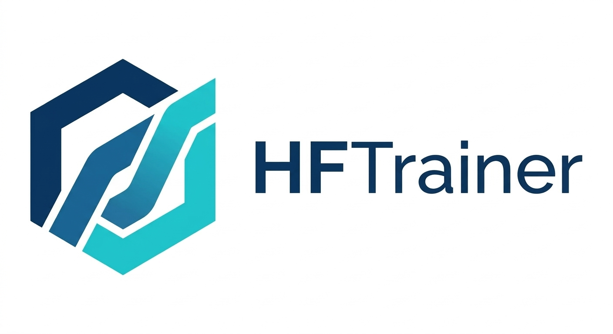

<div align="center">



# HF-Trainer · HyMotion M2M

**基于 HuggingFace 生态的配置驱动训练框架；本仓库当前主线为 HyMotion M2M（动作到动作通用补全 / 修复）。**

配置使用 MMEngine 风格 `.py`，运行时由 `accelerate` 统一分布式、混合精度与梯度累积；任务侧通过共享 **`ModelBundle`** 对齐训练与推理。

<p>
  
  
  
  
</p>

<p>
  <a href="hftrainer/models/motion/CLAUDE.md"><strong>M2M 技术栈文档</strong></a> •
  <a href="docs/zh-cn/motion_annot_web_overview.md"><strong>标注与 Web 基建</strong></a> •
  <a href="docs/zh-cn/index.md"><strong>框架文档（中文）</strong></a> •
  <a href="docs/en/index.md"><strong>框架文档（英文）</strong></a>
</p>

</div>

---

## HyMotion M2M 是什么

**HyMotion M2M（Motion-to-Motion）** 是基于 HunyuanMotion MMDiT 的 **通用动作补全** 模型：给定任意帧 × 任意关节上的条件掩码 `src_mask`（0=已知，1=生成），在 **归一化动作空间** 中做 **Flow Matching**，通过 **VACE 风格条件**（inactive / reactive / mask 与 `x_t` 拼接）注入已知运动与文本。

- **主线版本**：**M2M v2**，表示为 **198 维**（根平移 + SMPL-22 的 rot6d + FK 关节位置等；详见 `configs/hymotion_m2m_v2/_base_hymotion_m2m_v2_046b.py`）。
- **预训练**：文本编码与 DiT 主干多从 **HY-Motion T2M 1.0-Lite（0.46B）** 加载，输入/输出层按维度重初始化。
- **任务形态**：补全、预测、插帧、关节级编辑、轨迹约束、过渡拼接等，均由 **掩码采样策略（训练）+ 同一套 Pipeline（推理）** 覆盖。

完整约定（VACE、135/198 维、rot6d 行主序、transition 任务的规范坐标系、已知区域与训练分布等）见 **`hftrainer/models/motion/CLAUDE.md`**（必读，篇幅较长）。

---

## 训练（HyMotion M2M）

### 环境与安装

```bash
pip install -e .
# 演示用 checkpoint / 小数据（按需）
bash tools/download_checkpoints.sh
python3 tools/download_demo_data.py --task all
```

### 单卡 / 本地启动

入口统一为 **`tools/train.py`**，传入 **配置路径**（MMEngine `Config`，支持 `_base_` 继承）：

```bash
python3 tools/train.py configs/hymotion_m2m_v2/hymotion_m2m_v2_uncond_local_046b.py
```

多卡（示例 8 卡）：

```bash
bash tools/dist_train.sh configs/hymotion_m2m_v2/hymotion_m2m_v2_caption_local_046b.py 8
```

### 配置入口（v2 · 0.46B）

| 用途 | 配置示例 |
|------|-----------|
| v2 公共基座 | `configs/hymotion_m2m_v2/_base_hymotion_m2m_v2_046b.py` |
| 无条件 · 局部 / 全局旋转 | `hymotion_m2m_v2_uncond_local_046b.py`、`hymotion_m2m_v2_uncond_global_046b.py` |
| 文本条件 · caption | `hymotion_m2m_v2_caption_local_046b.py`、`hymotion_m2m_v2_caption_global_046b.py` |
| Caption 两阶段（phase1 / phase2） | `hymotion_m2m_v2_caption_*_phase1.py`、`*_phase2.py` |
| SOAR 后训练 | `configs/hymotion_m2m_v2/soar/hymotion_m2m_v2_*_046b_soar.py` |
| 冒烟 / 快速验证 | `hymotion_m2m_v2_smoke.py`、`hymotion_m2m_v2_smoke_soar.py` |

**太极集群**：请使用仓库提供的提交脚本（勿手写易错、不完整的 `taiji_client` 参数），例如：

```bash
python3 tools/taiji_submit.py <任务名> configs/hymotion_m2m_v2/hymotion_m2m_v2_uncond_local_046b.py --host_num 2
```

说明见 **`tools/taiji_submit.py`**（用法与参数）及项目根目录 **`CLAUDE.md`**（本地可见；在线浏览以本 README 与 `docs/zh-cn/` 为准）。

### 数据与质量（重要）

- 默认训练清单常为 **`data/annotation/train_hymotion_400h.json`**（样本量大但未做质量过滤）。
- **推荐**：使用基于 **`motion_annot_web`** 质量管线导出的 **高质量子集**（如 `data/hymotion_m2m_refine_data/data_quality_list/high_quality.json`），否则低质量样本会明显拉低效果上限。详见 **`hftrainer/models/motion/CLAUDE.md`** 中「训练数据质量问题」相关章节。

---

## 推理与评测

### 通用推理入口

与训练共享配置，使用 **`tools/infer.py`**（具体参数以配置中的 `pipeline` / `load_from` 为准）：

```bash
python3 tools/infer.py \
  --config configs/hymotion_m2m_v2/hymotion_m2m_v2_uncond_local_046b.py \
  --checkpoint <work_dirs/.../checkpoint-xxx> \
  ...
```

业务侧批评估、多任务协议（E1–E15 等）集中在：

```bash
python3 tools/eval_m2m_v2_all_tasks.py --help
```

**对接 motion_annot_web 评估看板**时：用于入库的 eval 跑批请 **`--save-npz`** 保存 NPZ，否则三维预览与部分回溯会缺文件；文本条件任务还需按看板约定带上 **`--use-rewritten`** 等参数（详见 **`docs/zh-cn/motion_eval_dashboard.md`**）。

### 过渡 / 拼接类任务（E14、E15、E9 等）

对两段运动拼接、大位姿差场景，推理前往往需要对构造段做 **规范坐标变换（canonicalize）**（锚点置原点 + 朝向对齐），再在输出后 **逆变换（decanonicalize）**；工具函数在 **`hftrainer/pipelines/motion/transition_utils.py`**。请勿跳过，否则易出现脚滑、跳变等伪影。

---

## 当前训练方案（概要）

以下为本仓库 **文档与代码的共识摘要**，细节仍以 **`hftrainer/models/motion/CLAUDE.md`** 为准。

| 维度 | 内容 |
|------|------|
| **条件形式** | VACE：`x_t` + inactive/reactive + mask；补全时 mask 区域在归一化后须 **置零** 再喂入，避免 reactive 泄露真值。 |
| **掩码训练** | **M1–M7** 七种采样策略（随机格点 / 块 / 时序连续 / 关节连续 / 全掩码 / 关键帧 / 稀疏关节等），覆盖 T2M、插帧、关节编辑、修复分布。 |
| **采样器版本** | `PrepareM2Mv2Condition` 支持 `sampler_version='v2'`（默认）与 **`v3`**（Rank-K 布尔先验，覆盖更广；在配置中切换）。 |
| **损失** | Flow Matching 速度场为主；v2 含 **FK 一致性 / KIMODO 风格辅助损失** 等可配置项（见 `_base_hymotion_m2m_v2_046b.py` 内 `losses_cfg` / `kimodo_aux_loss_cfg`）。 |
| **后训练** | **SOAR**（`HyMotionM2MSoarTrainer`）用于缓解 flow 模型的 exposure bias，配置在 `configs/hymotion_m2m_v2/soar/`。 |
| **修复对照** | **MoGenDIT** 通过 `hftrainer/pipelines/motion/mogendit_pipeline.py` 接入，用于 repair 基线及与 M2M 对比（与 M2M 的 mask、坐标约定不同，勿混用统计量）。 |

---

## 配套基建：`motion_annot_web`

`motion_annot_web/` 为 M2M 项目配套的 **Flask Web 工具集**，覆盖 **质量标注 → 修复调度 → 人工评分 → 推理展示 → Keypose 评估 → 评估看板** 的数据闭环。总览与端口如下（在线可读文档：**`docs/zh-cn/motion_annot_web_overview.md`**；本地完整说明见子目录 `CLAUDE.md`）。

| 应用 | 默认端口 | 作用 |
|------|-----------|------|
| **m2m_database** | 8085 | 大规模运动浏览、**高 / 边界 / 低质量** 标注、规则质检、损坏器、异步修复调度 |
| **score_m2m_refine** | 8080 | 修复结果 **多人评分**（原始高质量 / 修复成功 / 修复失败） |
| **completion_apps** | 8090 | 离线批量结果浏览 + **实时补全推理**（多任务、多模型变体） |
| **keypose_eval** | 8080 | Keypose 编辑 **前后对比**、最优变体、MP4 导出 |
| **eval_dashboard** | 8081 | M2M v2 **评估指标、雷达图、多模型对比、NPZ→SMPL 三维查看** |

典型启动（单机）：

```bash
cd motion_annot_web/m2m_database && python m2m_db_web.py --port 8085
cd motion_annot_web/completion_apps && python app.py --port 8090
# 其余子应用见 docs/zh-cn/motion_annot_web_overview.md
```

质量列表与 `data/hymotion_*` 目录约定亦见 **`docs/zh-cn/motion_annot_web_overview.md`**。

---

## 仓库结构（与本项目相关部分）

```text
configs/hymotion_m2m_v2/              # M2M v2 可运行配置（含 SOAR、caption 分阶段）
hftrainer/models/motion/hymotion_m2m/ # Bundle、MMDiT、损失
hftrainer/trainers/motion/            # HyMotionM2MTrainer / SoarTrainer
hftrainer/pipelines/motion/         # HyMotionM2MPipeline、transition_utils、MoGenDIT 封装
hftrainer/datasets/motion/          # MotionHub、条件变换、掩码采样
tools/                              # train.py、infer.py、eval_m2m_v2_all_tasks.py、太极提交等
motion_annot_web/                   # 标注 / 修复 / 评测 Web 基建
docs/temp/                          # 临时方案、实验记录、评测计划（草案默认放此目录）
```

---

## HF-Trainer 通用框架

本分支（`motion`）专注于 motion 任务栈：HyMotion M2M / T2M / UMO、PRISM、VerMo。
ViT 分类、SD15 / Wan 视频、LLM SFT/LoRA、StyleGAN2、DMD 等通用任务栈实现保留在 **`main` 分支**，入口仍为 `tools/train.py` / `tools/infer.py`。框架核心层（runner、ModelBundle、hooks、registry、accelerate 集成）两侧保持一致，差异只在 task-specific 子目录。

- [框架文档（英文）](docs/en/index.md)、[框架文档（中文）](docs/zh-cn/index.md)
- [API 参考](docs/zh-cn/api_reference.md)、[任务矩阵](docs/zh-cn/tasks.md)
- [Accelerate 集成与按模块隔离](docs/zh-cn/design/accelerate_integration.md)（per-submodule prepare 与 bundle-level orphan tensor 设计原理）

快速自检（motion 分支收录 6 个 motion smoke case）：

```bash
python3 -m pytest -m smoke tests/smoke/test_task_startup.py
```

---

## 致谢

HF-Trainer 借鉴 MMEngine 的配置与注册表模式，以及 HuggingFace / Accelerate 的模型与分布式运行时；HyMotion M2M 实现与 HyMotion / HunyuanMotion 预训练生态对齐。
