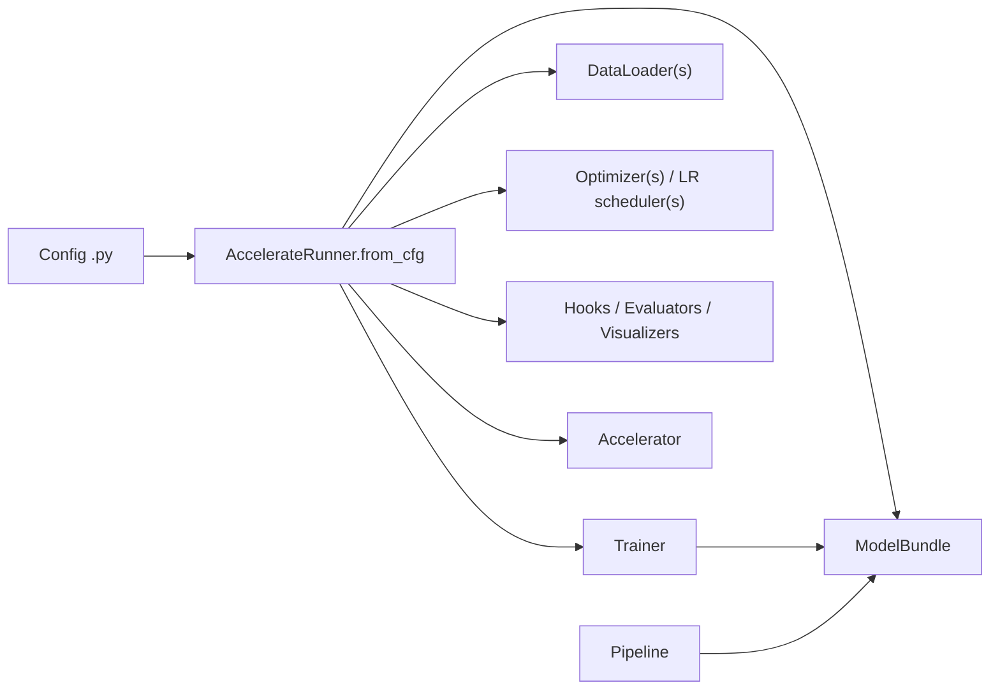
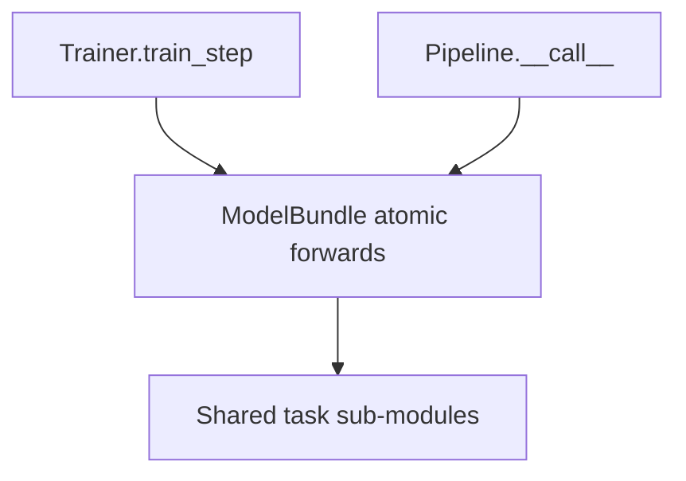

# Architecture

## High-Level Flow

## Key Pieces

`ModelBundle`

- owns task sub-modules
- defines shared atomic forward functions
- controls selective checkpoint save/load

`Trainer`

- assembles the training graph
- computes losses
- optionally owns optimization for multi-optimizer tasks

`Pipeline`

- assembles inference-time control flow
- reuses the same bundle logic as training

`AccelerateRunner`

- builds everything from config
- prepares trainable modules with `accelerate`
- handles validation, logging, checkpointing, and resume

`Hook`

- is a runner callback for runtime side effects
- is built from `default_hooks` and sorted by `priority`
- should handle logging / checkpoint / EMA, not task loss or forward logic

Validation metrics and rendering are handled separately by evaluators and visualizers. See [Hook System](design/hooks.md).

## Training vs Inference Reuse

## What Is Actually Implemented

End-to-end task stacks currently exist for:

- `ViTBundle` + `ClassificationTrainer` + `ClassificationPipeline`
- `SD15Bundle` + `SD15Trainer` + `SD15Pipeline`
- `CausalLMBundle` + `CausalLMTrainer` + `CausalLMPipeline`
- `WanBundle` + `WanTrainer` + `WanPipeline`
- `StyleGAN2Bundle` + `GANTrainer` + `StyleGAN2Pipeline`
- `DMDBundle` + `DMDTrainer` + `DMDPipeline`

The GAN and DMD stacks are reference implementations. They align with the core
training structure of StyleGAN2 and DMD, but they are not intended to claim
benchmark-level reproduction without additional tuning.
