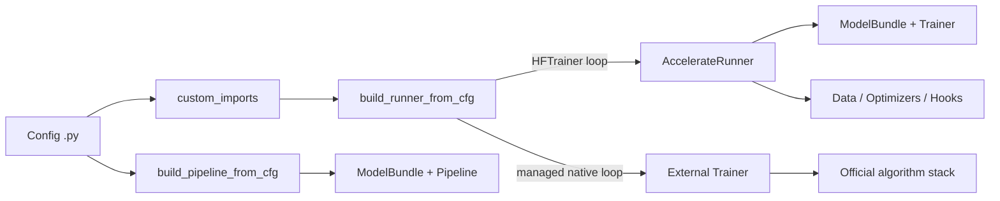
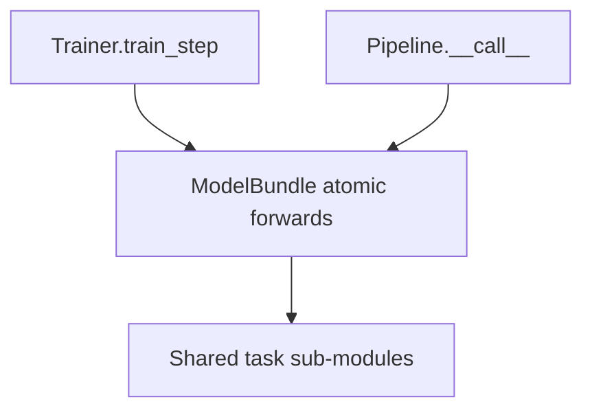

# Architecture

## High-Level Flow


```mermaid
flowchart LR
    A["Config .py"] --> B["custom_imports"]
    B --> C["build_runner_from_cfg"]
    C -->|HFTrainer loop| D["AccelerateRunner"]
    C -->|managed native loop| E["External Trainer"]
    D --> F["ModelBundle + Trainer"]
    D --> G["Data / Optimizers / Hooks"]
    E --> H["Official algorithm stack"]
    A --> I["build_pipeline_from_cfg"]
    I --> J["ModelBundle + Pipeline"]
```

## Key Pieces

`ModelBundle`

- owns task sub-modules
- defines shared atomic forward functions
- controls selective checkpoint save/load

`Trainer`

- assembles the training graph
- computes losses
- optionally owns optimization for multi-optimizer tasks

`Pipeline`

- assembles inference-time control flow
- reuses the same bundle logic as training

`AccelerateRunner`

- builds everything from config
- prepares trainable modules with `accelerate`
- handles validation, logging, checkpointing, and resume

`Managed Trainer`

- is selected when a registered trainer declares `manages_training_loop=True`
- lets a tightly coupled upstream algorithm own its Accelerator, optimizer,
  checkpoint, validation, and resume behavior
- still receives paths, output directories, overrides, and imports from the
  HFTrainer config/CLI surface

`Hook`

- is a runner callback for runtime side effects
- is built from `default_hooks` and sorted by `priority`
- should handle logging / checkpoint / EMA, not task loss or forward logic

Validation metrics and rendering are handled separately by evaluators and visualizers. See [Hook System](design/hooks.md).

## Lightweight registration

`import hftrainer` creates registries and lightweight public symbols only. It
does not eagerly import every task, Accelerate, Transformers, Diffusers, or
optional LTX packages. Built-in applications can call
`hftrainer.register_all_modules()`, while normal configs should declare the
smallest vertical slice they need:

```python
custom_imports = dict(
    imports=['hftrainer.models.ltx_video', 'hftrainer.pipelines.ltx_video'],
    allow_failed_imports=False,
)
```

This makes optional dependencies genuinely optional and keeps import failures
local to the feature being built.

## Training vs Inference Reuse


```mermaid
flowchart TB
    A["Trainer.train_step"] --> B["ModelBundle atomic forwards"]
    C["Pipeline.__call__"] --> B
    B --> D["Shared task sub-modules"]
```

## What Is Actually Implemented

End-to-end task stacks currently exist for:

- `ViTBundle` + `ClassificationTrainer` + `ClassificationPipeline`
- `SD15Bundle` + `SD15Trainer` + `SD15Pipeline`
- `CausalLMBundle` + `CausalLMTrainer` + `CausalLMPipeline`
- `WanBundle` + `WanTrainer` + `WanPipeline`
- `StyleGAN2Bundle` + `GANTrainer` + `StyleGAN2Pipeline`
- `DMDBundle` + `DMDTrainer` + `DMDPipeline`
- `LTXVideoBundle` + `LTXVideoPipeline`, plus the managed
  `LTXVideoTrainer` adapter over the pinned official LTX stack

The GAN and DMD stacks are reference implementations. They align with the core
training structure of StyleGAN2 and DMD, but they are not intended to claim
benchmark-level reproduction without additional tuning.

The LTX integration has contract/config tests but has not been exercised with
the full 22B checkpoint in the repository test environment. See
[LTX-Video 2.5](models/ltx_video_2_5.md) for the exact validation boundary.
