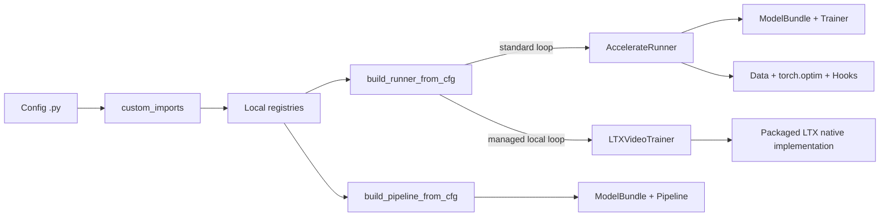
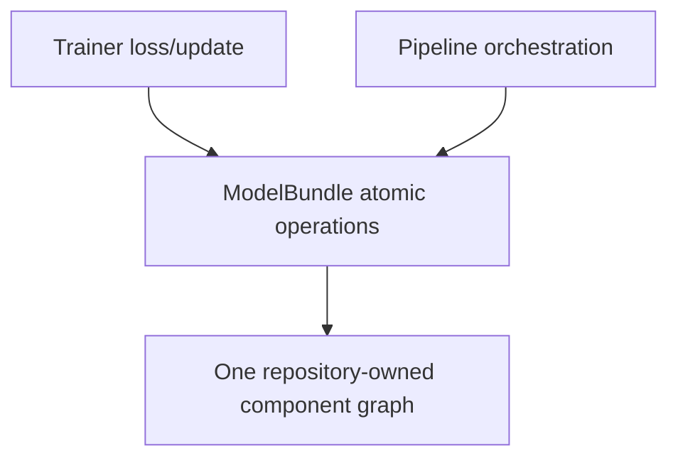

# Architecture

## High-level flow


```mermaid
flowchart LR
    A["Config .py"] --> B["custom_imports"]
    B --> C["Local registries"]
    C --> D["build_runner_from_cfg"]
    D -->|standard loop| E["AccelerateRunner"]
    D -->|managed local loop| F["LTXVideoTrainer"]
    E --> G["ModelBundle + Trainer"]
    E --> H["Data + torch.optim + Hooks"]
    F --> I["Packaged LTX native implementation"]
    C --> J["build_pipeline_from_cfg"]
    J --> K["ModelBundle + Pipeline"]
```

Both branches execute code shipped in this repository. A managed trainer owns
an unusually coupled lifecycle; it is not an adapter that imports a trainer
from another checkout or installed model package.

## Layer responsibilities

`ModelBundle`

- owns the components required by one implementation;
- exposes atomic operations shared by training and inference;
- records trainability, dtype, gradient-checkpointing, and selective checkpoint
  policy;
- loads and exports an implementation-owned artifact schema.

`Trainer`

- owns losses, update order, and training-only validation;
- either runs inside `AccelerateRunner`, or explicitly declares a managed local
  loop when one algorithm's preprocessing/checkpoint lifecycle cannot be split.

`Pipeline`

- owns inference orchestration and public inputs/outputs;
- calls the same bundle operations as training rather than constructing a
  second model graph.

`AccelerateRunner`

- builds the experiment from config;
- prepares local model modules and `torch.optim` objects through Accelerate;
- handles validation, logging, checkpointing, and resume.

`Hook`, evaluator, and visualizer

- hooks handle runtime side effects such as logging, checkpointing, and EMA;
- evaluators compute metrics from standardized validation outputs;
- visualizers serialize human-inspectable results.

See [Hook System](design/hooks.md) for callback ordering.

## Package taxonomy

The package tree expresses ownership. One namespace must not mix task names
with model/paper names at the same level.

| Namespace | Ownership axis | Canonical examples |
| --- | --- | --- |
| `hftrainer/models/` | concrete implementation | `vit`, `llama`, `sd15`, `wan`, `stylegan2`, `dmd`, `ltx_video` |
| `hftrainer/models/<id>/network/` | model math and model-specific primitives | attention blocks, VAE, tokenizer, scheduler |
| `hftrainer/trainers/` | implementation-specific optimization | `sd15`, `wan`, `stylegan2`, `dmd`, `ltx_video` |
| `hftrainer/pipelines/` | implementation-specific inference | `sd15`, `wan`, `stylegan2`, `dmd`, `ltx_video` |
| `hftrainer/tasks/` | genuinely reusable task contract | `image_classification`, `causal_language_modeling` |
| `hftrainer/datasets/` | record/collation contract | `image_classification`, `instruction_sft`, `text_to_image`, `text_to_video`, `unconditional_image`, `dmd` |
| `hftrainer/evaluation/` | reusable metric contract | `image_classification`, `causal_language_modeling` |
| `configs/` | implementation selected by the user | `vit`, `llama`, `sd15`, `wan`, `stylegan2`, `dmd`, `ltx_video` |

Use the same `implementation_id` across model, trainer, pipeline, and config
when behavior belongs to one concrete method. Move a trainer/pipeline into
`tasks/<task_contract>` only when its logic is truly reusable by multiple model
families. ViT and LLaMA currently use those reusable task contracts; SD1.5,
Wan, StyleGAN2, DMD, and LTX keep implementation-specific trainers/pipelines.

Every registered model component must have one implementation owner, one
registry registration, and one canonical package export. Structural tests
reject task-shaped model aliases and components exported from a second model
hierarchy.

## Model dependency boundary

`MODEL_COMPONENTS` is the only component-construction registry. A component
name must resolve to repository code under `hftrainer.models.*`; dotted class
paths and arbitrary import fallbacks are rejected.

The model execution boundary includes:

- model layers and forward math;
- tokenizers/processors used by the model;
- sampling/noise schedulers whose behavior is part of the method;
- LoRA injection, adapter save/load, and merge;
- artifact parsing and validation;
- training and inference orchestration.

General infrastructure libraries remain dependencies, including PyTorch,
Accelerate, MMEngine, safetensors, NumPy, and Pillow. They do not select or own
the concrete model implementation. Source-tree AST checks and fresh-process
import blockers guard the forbidden model-package boundary.

LTX follows the same rule through `LTXComponentStore`. An `LTXVideoBundle`
owns the inference registry passed into every local backend builder, while the
managed trainer owns a separate non-caching training registry and injects it
through validation and every component loader. Mutable training modules can
therefore never alias an inference shell, and no loader creates a hidden model
implementation or private cache.

## Lightweight registration

`import hftrainer` creates registries and lightweight symbols. Concrete
implementations are registered either by a config's precise `custom_imports`
slice or by `hftrainer.register_all_modules()`:

```python
custom_imports = dict(
    imports=[
        'hftrainer.models.ltx_video',
        'hftrainer.trainers.ltx_video',
        'hftrainer.pipelines.ltx_video',
    ],
    allow_failed_imports=False,
)
```

Missing support utilities therefore fail only when the corresponding feature
is built, while model-class resolution always stays local.

## Training and inference reuse


```mermaid
flowchart TB
    A["Trainer loss/update"] --> B["ModelBundle atomic operations"]
    C["Pipeline orchestration"] --> B
    B --> D["One repository-owned component graph"]
```

## Implemented stacks and validation limits

- `ViTBundle` + reusable image-classification trainer/pipeline;
- `LlamaBundle` + reusable causal-language-modeling trainer/pipeline;
- `SD15Bundle` + `SD15Trainer` + `SD15Pipeline`;
- `WanBundle` + `WanTrainer` + `WanPipeline`;
- `StyleGAN2Bundle` + `StyleGAN2Trainer` + `StyleGAN2Pipeline`;
- `DMDBundle` + `DMDTrainer` + `DMDPipeline`;
- `LTXVideoBundle` + local managed `LTXVideoTrainer` + `LTXVideoPipeline`.

StyleGAN2 and DMD are framework-oriented reference implementations rather than
benchmark claims. LTX contract/config and tiny local Gemma paths are tested,
but the repository test environment has not executed the gated 22B workflow.
See [LTX-Video 2.5](models/ltx_video_2_5.md) for the exact boundary.
