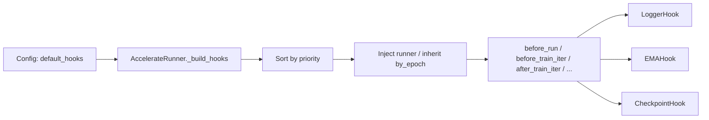

# Hook System

HF-Trainer hooks are runner-owned callbacks for runtime side effects. They are not the place for task forward logic, loss definition, or optimization order.

## Boundaries

- `Trainer` owns `train_step`, loss assembly, and optimization behavior.
- `Hook` owns side effects such as logging, checkpointing, and EMA state maintenance.
- `Evaluator` and `Visualizer` run in validation and consume `val_step()` outputs. They are separate from hooks.

## Where Hooks Fit



## Lifecycle

The runner calls hook methods at fixed points:

| Callback | When it runs | Notes |
| --- | --- | --- |
| `before_run` | once before training starts | setup state |
| `before_train_epoch` | before each epoch | only when `train_cfg.by_epoch=True` |
| `before_train_iter` | before each training iter | both iter-based and epoch-based loops |
| `after_train_iter` | after each training iter | both iter-based and epoch-based loops |
| `after_train_epoch` | after each epoch | only when `train_cfg.by_epoch=True` |
| `after_run` | once after training ends | `CheckpointHook.save_last` uses this |

## Priority and Execution Order

Hooks are sorted by ascending `priority`. Lower numbers run earlier.

Current built-in hooks:

| Hook | Priority | Default | Purpose |
| --- | --- | --- | --- |
| `LoggerHook` | `10` | yes | log scalar metrics and LR |
| `EMAHook` | `15` | no | maintain an EMA copy of trainable modules |
| `LRSchedulerHook` | `20` | no | compatibility placeholder |
| `CheckpointHook` | `80` | yes | save periodic and final checkpoints |

In the default runtime config, the effective order is:

1. `LoggerHook`
2. `CheckpointHook`

If you add `EMAHook`, it runs between logging and checkpointing.

## Built-In Hook Semantics

### `LoggerHook`

- Reads training outputs after each iter.
- Auto-inherits `by_epoch` from `train_cfg` when `by_epoch=None`.
- Logs LR from runner-owned schedulers and metrics through `accelerator.log(...)`.

### `CheckpointHook`

- Calls `runner.save_checkpoint()`.
- Saves selective model weights through `bundle.state_dict_to_save()`.
- Saves optimizer / scheduler / RNG state through `accelerator.save_state(...)`.
- `save_last=True` triggers one final save in `after_run`.

### `EMAHook`

- Maintains `ema_bundle`, a frozen EMA copy of trainable modules.
- Updates EMA after `after_train_iter` according to `update_interval`.
- Important: the runner does not automatically swap EMA weights into validation or inference yet. `EMAHook` currently maintains state only.

### `LRSchedulerHook`

- Exists for compatibility with MMEngine-style configs.
- Scheduler stepping is already handled directly inside `AccelerateRunner`.
- In practice you usually should not add this hook manually.

## Config Pattern

Default runtime config:

```python
default_hooks = dict(
    logger=dict(
        type='LoggerHook',
        interval=10,
    ),
    checkpoint=dict(
        type='CheckpointHook',
        interval=1000,
        max_keep_ckpts=3,
        save_last=True,
    ),
)
```

Optional EMA:

```python
default_hooks = dict(
    logger=dict(type='LoggerHook', interval=10),
    ema=dict(type='EMAHook', decay=0.9999, update_interval=1),
    checkpoint=dict(type='CheckpointHook', interval=1000, max_keep_ckpts=3),
)
```

You usually do not need to set `by_epoch` on hooks manually. When `by_epoch=None`, the runner inherits it from `train_cfg.by_epoch`.

## Common Confusions

- `default_hooks` is not an ordered list in config. Runtime order comes from `priority`, not dict key order.
- Validation is not a hook in HF-Trainer. The runner calls `val()`, then evaluators compute metrics, then visualizers render outputs.
- Multi-optimizer tasks still keep optimization logic in the trainer. Hooks do not control adversarial update order.
