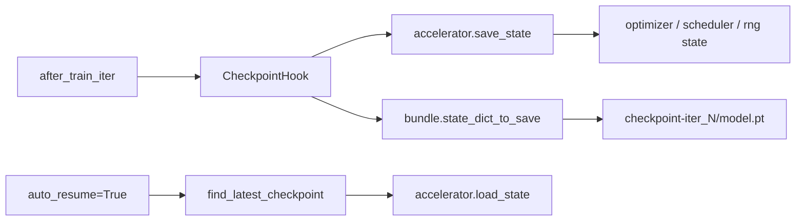

# Experiment Directory

Each run writes two kinds of artifacts:

- a timestamped run directory for logs and dumped config
- checkpoint directories under the experiment root

## Layout

```text
work_dirs/{experiment}/
├── 20260310_204813/
│   ├── config.py
│   └── train.log
├── checkpoint-iter_1/
│   ├── model.pt
│   ├── model.safetensors
│   ├── optimizer.bin
│   ├── scheduler.bin
│   ├── random_states_0.pkl
│   └── meta.pt
└── checkpoint-iter_2/
```

## Semantics

- `checkpoint-iter_N` means `N` optimizer steps have completed.
- `checkpoint-epoch_N` means `N` full epochs have completed.
- `meta.pt` stores `global_step` and `current_epoch` using the same completed-count semantics, so auto-resume continues from the next step instead of repeating the last one.

## Auto Resume

Set:

```python
auto_resume = True
```

The runner scans `work_dir`, finds the latest checkpoint, loads the full accelerator state, and continues training.

## Save / Resume Flow


