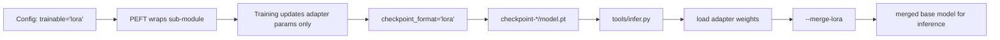

# LoRA

HF-Trainer supports config-driven LoRA at the sub-module level.

## Config Pattern

Use `trainable='lora'` on any bundle sub-module that is supported by PEFT:

```python
model = dict(
    type='CausalLMBundle',
    model=dict(
        type='AutoModelForCausalLM',
        from_pretrained=dict(
            pretrained_model_name_or_path='checkpoints/TinyLlama-1.1B-Chat-v1.0',
            torch_dtype='auto',
        ),
        trainable='lora',
        checkpoint_format='lora',  # optional; this is the default for LoRA modules
        lora_cfg=dict(
            task_type='CAUSAL_LM',
            r=16,
            lora_alpha=32,
            lora_dropout=0.05,
            target_modules='all-linear',
        ),
    ),
)
```

Supported checkpoint formats for LoRA modules:

- `checkpoint_format='lora'`: save adapter weights only
- `checkpoint_format='full'`: save the full wrapped module state dict

When `trainable='lora'`, HF-Trainer defaults to `checkpoint_format='lora'`.

## Recommended Demo

Runnable reference config:

- `configs/llm/llama_lora_demo.py`

Train:

```bash
python3 tools/train.py configs/llm/llama_lora_demo.py
```

## Checkpoint Behavior

HF-Trainer writes adapter-only weights into `checkpoint-*/model.pt` together with metadata describing each module's checkpoint format.

For LoRA checkpoints, `model.pt` contains only adapter weights by default, not the frozen base model weights. This keeps checkpoint size small and makes model-only loading fast.

`load_scope='model'`:

- loads the selective bundle weights only

`load_scope='full'`:

- resumes through `accelerator.load_state(...)`
- restores optimizer / scheduler / RNG state

## Save / Load / Merge Flow



## Inference and Merge

Load the LoRA checkpoint and merge it into the base model for inference:

```bash
python3 tools/infer.py \
  --config configs/llm/llama_lora_demo.py \
  --checkpoint work_dirs/llama_lora_smoke/checkpoint-iter_10 \
  --merge-lora \
  --prompt "What is the capital of France?"
```

`--merge-lora` merges adapter weights into the base weights in memory before running the pipeline.

## Scope

HF-Trainer exposes LoRA at the `ModelBundle` level, so the pattern is the same across tasks. In practice, LoRA still depends on PEFT support for the specific model class and the configured `target_modules`.

The currently verified end-to-end demo is the Causal LM LoRA path.
