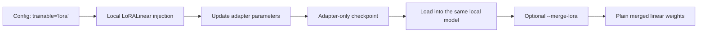

# LoRA

HFTrainer implements LoRA locally in `hftrainer.models.lora`. It injects
`LoRALinear` into repository-owned `torch.nn.Linear` modules; no adapter
framework is imported or required.

## Config pattern

Set `trainable='lora'` on a bundle sub-module and provide the local LoRA
options:

```python
model = dict(
    type='LlamaBundle',
    model=dict(
        type='LocalLlamaForCausalLM',
        from_pretrained=dict(
            pretrained_model_name_or_path='checkpoints/TinyLlama-1.1B-Chat-v1.0',
            torch_dtype='auto',
        ),
        trainable='lora',
        checkpoint_format='lora',
        lora_cfg=dict(
            r=16,
            lora_alpha=32,
            lora_dropout=0.05,
            target_modules='all-linear',
            bias='none',
        ),
    ),
)
```

Supported local options:

- `r` or `rank`: positive adapter rank;
- `lora_alpha` or `alpha`: residual scale numerator;
- `lora_dropout` or `dropout`: input dropout in `[0, 1)`;
- `target_modules`: `'all-linear'`, one qualified-name suffix, or a list of
  suffixes;
- `bias`: `'none'`, `'all'`, or `'lora_only'`.

The legacy `task_type` key is accepted and ignored so existing HFTrainer
recipes remain readable; it does not select another implementation.

## Training and checkpoints

Runnable config:

- `configs/llama/llama_lora_demo.py`

```bash
python3 tools/train.py configs/llama/llama_lora_demo.py
```

When LoRA is injected, base parameters are frozen and only the matched adapter
parameters (plus configured biases) are trainable. `checkpoint_format='lora'`
is the default for a LoRA sub-module and writes adapter-only tensors into
`checkpoint-*/model.pt`; the frozen base checkpoint is not duplicated.

Use `checkpoint_format='full'` only when the complete LoRA-injected module state
is intentionally required.

Checkpoint loading scopes remain independent from the adapter format:

- `load_scope='model'` loads the bundle's selected model state;
- `load_scope='full'` resumes optimizer, scheduler, and RNG state through the
  runner in addition to the model state.

## Save, load, and merge


```mermaid
flowchart LR
    A["Config: trainable='lora'"] --> B["Local LoRALinear injection"]
    B --> C["Update adapter parameters"]
    C --> D["Adapter-only checkpoint"]
    D --> E["Load into the same local model"]
    E --> F["Optional --merge-lora"]
    F --> G["Plain merged linear weights"]
```

For inference with a saved adapter:

```bash
python3 tools/infer.py \
  --config configs/llama/llama_lora_demo.py \
  --checkpoint work_dirs/llama_lora_smoke/checkpoint-iter_10 \
  --merge-lora \
  --prompt "What is the capital of France?"
```

`--merge-lora` adds each low-rank update to its base weight in memory and
replaces the adapter wrapper with a plain linear layer before inference.

## Scope and failure behavior

The local injector currently targets `torch.nn.Linear`. It raises an error
when no configured target matches, when an adapter is injected twice, or when
an adapter checkpoint has missing/unexpected keys. This prevents silently
training or loading a partial adapter.

QLoRA is deliberately unavailable until HFTrainer owns and validates a local
4-bit linear implementation. Use local LoRA or full fine-tuning instead.
