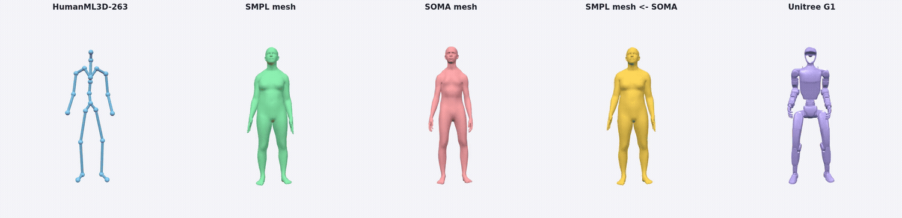
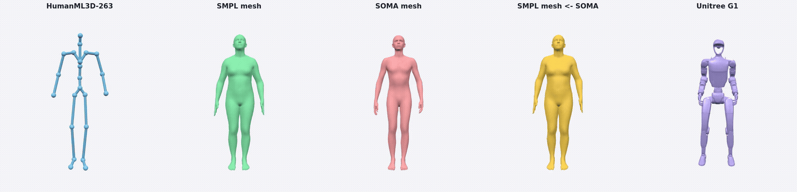
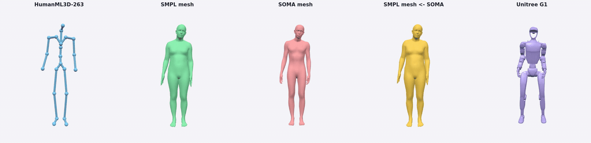

# Motion Representations & Conversions

Authoritative reference for the motion representations used across the repo and
how to convert between them. **If you only read one thing: use
`hftrainer.motion.representation.convert` as the single entry point and never
hand-pick a low-level helper again.**

The machine-readable source of truth for every layout is
[`hftrainer/motion/representation/specs.py`](../../hftrainer/motion/representation/specs.py)
(`get_spec`, `list_specs`, `infer_spec_from_dim`).

## Operating Contract

All new motion work in this repository must follow these rules:

1. **Declare the representation at every boundary**: model output, saved file,
   evaluator input, viewer input and conversion intermediate. Do not describe a
   file as just "motion"; write `HML263`, `motion_135`, `MS272`, `SOMA30`, etc.
2. **Use `hftrainer.motion.representation.convert` for cross-representation
   conversion**. Low-level helpers are implementation details unless a doc says
   otherwise.
3. **Do not repack rot6d by hand**. Use
   `hftrainer.motion.representation.rotation.repack_6d` with explicit
   `src`/`dst`.
4. **Never mix evaluator spaces**. HML3D-263 metrics and MS-272 metrics are both
   required for T2M baselines, but their numbers are not comparable.
5. **Keep fps explicit**. HML263 is 20 fps; SMPL `motion_135` and MS272 are
   30 fps. Any conversion that changes fps must name the source and target fps.
6. **Viewer input is `motion_135` unless the viewer states otherwise**. T2M
   comparison viewers render SMPL-style `motion_135` NPZ files, not HML263 or
   MS272 directly.
7. **Write metric JSON and conversion logs next to outputs**. A model card
   metric without the exact output directory and command is not considered
   reproducible.

If a new method cannot satisfy one of these rules, document the exception in the
model card before reporting metrics.

---

## 1. Representation cheat-sheet

| name | dim | fps | body | joints | rot6d | transl | notes |
|------|-----|-----|------|--------|-------|--------|-------|
| `motion_135` | 135 | 30 | SMPL-22 | 22 | **ROW** | abs (3) | `[transl(3), 22×rot6d]`. HYMotion M2M canonical. |
| `138` | 138 | 30 | SMPL-22 | 22 | **COLUMN** | abs_rel (6) | PRISM / VerMo. `[transl_abs(3), transl_rel(3), 22×rot6d]`. |
| `198` | 198 | 30 | SMPL-22 | 22 | ROW | abs (3) | HYMotion M2M extended. |
| `147` / `151` | — | 30 | SMPL | — | ROW | mixed | HYMotion/MoGenDIT variants with contacts or auxiliary channels. |
| `201` / `motion_201` | 201 | 30 | SMPL-22 + RIC aux | 22 | ROW | abs in official T2M decode | HYMotion T2M official checkpoint space. `[0:135]` is `motion_135`; `[135:201]` is 22×3 root-invariant joint positions. |
| `HML263` | 263 | **20** | HumanML-22 | 22 | **COLUMN** (rot block) | redundant | HumanML3D / MoMask / MDM / FlowMDM output. |
| `MS272` | 272 | 30 | canon272 | 22 | **ROW** | redundant | MotionStreamer-272 evaluator space. |
| `IH262` / `interhuman_262` | 262 | 30 | SMPL-22 | 22 (rot: **21**) | **ROW** | baked into canonical pos | InterHuman / InterGen two-person T2M + InterCLIP space. `[pos66, vel66, 21×rot6d, foot4]`. Encode drops last frame (`T-1`). |

Full per-channel field maps (start/end indices) are in `specs.py`. Example:

```python
from hftrainer.motion.representation.specs import get_spec
get_spec("ms272").fields          # FieldSpec blocks with [start,end)
get_spec(263).rot6d_convention     # "column"
get_spec("motion_135").fps         # 30
```

### 1.1 Calculation method by representation

This section describes how each representation is **computed**, not only how it
is shaped. When debugging metrics, always ask which of these computation paths
created the file on disk.

#### `motion_135`

```text
[0:3]     absolute root translation, metres, Y-up
[3:135]   22 local joint rotations, rot6d ROW-major
```

`motion_135` is the canonical SMPL-style feature used by the T2M viewer and by
HYMotion M2M. It is computed from SMPL local rotations by packing the first two
rows of each joint rotation matrix, flattening the 22 joints in kinematic order,
and prepending the root translation. Joint positions are not stored; they are
obtained by FK with an explicitly chosen skeleton. Because no shape/betas are
stored, mesh-space reconstruction normally uses a neutral body unless an
external SMPL/SMPL-X parameter file is available.

#### `motion_138`

```text
[0:3]     absolute root translation
[3:6]     relative/root-velocity translation channels
[6:138]   22 local joint rotations, rot6d COLUMN-major
```

`motion_138` is the PRISM / MCM / VerMo feature space. It is not a padded
`motion_135`: the translation head contains both absolute and relative channels,
and the rot6d block follows the COLUMN packing used by the older
`SMPLPoseProcessor` path. Convert or evaluate it with a decoder that explicitly
knows this convention; feeding the last 132 dims into a ROW-major FK path gives
plausible-looking but wrong motion.

#### `motion_198`, `motion_147`, `motion_151`

These are `motion_135` heads plus auxiliary supervision channels:

```text
motion_198 = motion_135 + 21 non-root FK joint positions (21×3)
motion_147 = motion_135 + 4 end-effector positions (4×3)
motion_151 = motion_147 + 4 foot-contact flags
```

The first 135 channels are the recoverable SMPL-style motion. The extra channels
are computed from FK/contact heuristics and are used for losses, conditioning, or
diagnostics. They should not be interpreted as additional joint rotations.

#### `motion_201`

```text
[0:3]       absolute root translation
[3:9]       root rot6d, ROW-major
[9:135]     21 body-joint local rot6d, ROW-major
[135:201]   22 root-invariant joint positions (22×3)
```

This is the HYMotion T2M official `o6dp_1103` checkpoint space after
denormalization. The official decoder calls `_decode_o6dp_1103(...,
rel_trans=False)`, so `[0:3]` is read directly; it is **not** accumulated with
`cumsum`. The first 135 dims can be exported losslessly as `motion_135` for SMPL
mesh rendering and MS272 conversion. The last 66 dims are RIC positions computed
by FK and subtracting the pelvis position from all 22 joints; they are auxiliary
channels and are ignored by current SMPL/MS272 scoring.

#### `HML263`

```text
[0:1]     root yaw velocity
[1:3]     root xz linear velocity
[3:4]     root height y
[4:67]    21 non-root RIC joint positions
[67:193]  21 non-root cont6d rotations, COLUMN-major
[193:259] 22 local joint velocities
[259:263] 4 foot-contact flags
```

HumanML3D-263 is produced by the HumanML `process_file` pipeline: floor align the
joint sequence, place the first frame root xz at the origin, remove the facing
heading, compute root yaw/xz velocities, root height, root-invariant positions,
cont6d local rotations, local velocities, and foot contacts. It is a 20-fps
kinematic feature, not an SMPL parameter file. Standard decoding uses
`recover_from_ric` to reconstruct 22 joint positions from the velocity and RIC
channels; the rot block is usually not used directly for viewer/mesh output.

#### `MS272`

```text
[0:2]      heading-removed root xz velocity
[2:8]      per-frame heading delta, rot6d ROW-major
[8:74]     22 heading-removed joint positions, root xz at per-frame origin
[74:140]   22 heading-removed joint velocities
[140:272]  22 local joint rotations, rot6d ROW-major
```

MotionStreamer-272 is the evaluator space for MotionStreamer / GoToZero style
HumanML3D scoring. Official GT generation is:

```text
SMPL-85/raw params
  -> first-frame face-Z canonicalization
  -> SMPL-X FK with the provided betas
  -> floor align + first-frame root xz origin
  -> remove per-frame heading
  -> pack root velocity, heading delta, positions, velocities, local rotations
```

Translation and rotations are recoverable, but not as a contiguous SMPL-135 head.
Root translation is reconstructed by accumulating `[0:2]` in the recovered
heading frame and taking root height from `[8:74]`; local rotations come from
`[140:272]` after restoring the root heading. The stored positions in `[8:74]`
are also directly decodable. Because MS272 does **not** store betas, FK from the
recovered rotations with a neutral SMPL-H/SMPL-X body will generally not exactly
match the stored positions.

Two conversion paths must stay separate:

- `smpl85_to_272` is the official raw-SMPL path and is exact when the raw SMPL
  params/betas are available.
- `motion135_to_272` is an approximate bridge for generated `motion_135`; it
  uses fixed GT-272 canonical offsets and cannot recover subject-specific shape.

#### `IH262` / `interhuman_262`

```text
[0:66]     22 canonical joint positions
[66:132]   22 forward-difference joint velocities
[132:258]  21 non-root SMPL body rot6d, ROW-major
[258:262]  4 foot-contact flags
```

InterHuman-262 is computed from SMPL-X joints/body pose by mapping to the
InterGen coordinate frame, floor-aligning, zeroing the first-frame root xz,
rotating the first frame to face +Z, then packing positions, velocities,
non-root local body rotations, and contacts. Encoding drops the last frame
because velocities use a forward difference. Decode for visualization reads the
stored positions directly; FK is not required.

#### Raw SMPL-85 / SMPL parameter arrays

Raw SMPL is not a fixed-width registry representation in this table, but it is a
conversion input. MotionStreamer uses SMPL-85 layout:

```text
[0:3]    global_orient axis-angle
[3:72]   body_pose axis-angle
[72:75]  translation
[75:85]  betas
```

When these parameters exist, prefer `smpl85_to_272` or
`smpl_params_to_272` over going through `motion_135`, because the raw path keeps
shape/betas and matches the official MS272 generation code.

---

## 2. The rot6d convention trap (read this)

There are **two** 6D rotation layouts in this repo. Picking the wrong one
silently produces wrong rotations and inflated FID — this is the single most
common bug in motion conversions here.

| layout | packing | used by |
|--------|---------|---------|
| **COLUMN** (math default) | `[R00,R10,R20, R01,R11,R21]` (first two columns) | `HML263` rot block; `motion_138`; MotionCLIP/MDM rot helpers; every `*_6d_*` math fn default. |
| **ROW** (data/model I/O) | `[R00,R01, R10,R11, R20,R21]` (first two rows) | `motion_135`/`198`/`201`, HYMotion checkpoints, `MS272` rot block, **`IH262` rot block**. |

> **Note on `IH262` "component-interleaved" rot6d.** The InterHuman/InterGen 262
> rotation block is sometimes described as component-interleaved
> `[c0x,c1x,c0y,c1y,c0z,c1z]`. That packing is **identical to this repo's ROW
> layout** (`R00=c0x, R01=c1x, R10=c0y, ...`). Use `convention="row"` — there is
> no third convention. Using COLUMN for `IH262` silently drops ~0.3 InterCLIP R@3.

Rules of thumb:

- HYMotion-style `motion_135`/`motion_201` files and MS272/IH262 rot blocks are
  **ROW**.
- `motion_138` and the HML263 rotation block are **COLUMN**. Treat them as
  explicit exceptions, not as padded `motion_135`.
- The pure-math `rotation_6d_to_matrix(d6)` default is **COLUMN**; always pass
  `convention=` explicitly when in doubt.
- HYMotion official `rot6d_to_rotation_matrix` uses the ROW layout used by
  `motion_135`/`motion_201`, despite sharing a similar name with the math helper.
- To re-pack a stored vector between layouts **without changing the rotation**:

```python
from hftrainer.motion.representation.rotation import repack_6d, Rot6DConvention
row_vec = repack_6d(col_vec, src=Rot6DConvention.COLUMN, dst=Rot6DConvention.ROW)
```

The canonical implementation lives in
[`hftrainer/motion/representation/rotation.py`](../../hftrainer/motion/representation/rotation.py)
(`Rot6DConvention`, `repack_6d`, `rotation_6d_to_matrix`,
`matrix_to_rotation_6d`, `matrix_to_axis_angle`, ...). The old path
`hftrainer.models.motion.components.utils.geometry.rotation_convert` is a thin
compatibility shim re-exporting from there.

---

## 3. Conversion map (the only API you need)

All cross-representation conversions go through
[`hftrainer.motion.representation.convert`](../../hftrainer/motion/representation/convert.py).
Each function has an explicit, documented convention and fps:

```text
HML263 (263,20fps) --hml263_to_joints-->       joints (T,22,3)
HML263 (263,20fps) --hml263_to_motion135-->    motion_135 (135,30fps, ROW)  [SMPL IK]
SMPL-85/raw params --smpl85_to_motion272-->     MS272 (272,30fps)            [official SMPL-X FK]
motion_135 (ROW)   --motion135_to_motion272--> MS272 (272,30fps)            [canon272 FK bridge + encode]
MS272 (272,30fps)  --motion272_to_hml263-->    HML263 (263,20fps)           [decode + re-encode]
MS272 (272,30fps)  --motion272_to_joints-->    joints (T,22,3)
```

```python
from hftrainer.motion.representation import convert

joints = convert.hml263_to_joints(m263)            # recover_from_ric (native, no ref_repo)
m135   = convert.hml263_to_motion135(m263)         # ROW-major, SMPL IK
m272   = convert.motion135_to_motion272(m135)      # canon272 FK + encode
m272_s = convert.smpl85_to_motion272(smpl_85)      # raw SMPL-85 -> official SMPL-X FK + encode
m272b  = convert.hml263_to_motion272(m263)         # full chain in one call
```

**No `repack_col2row` step is needed**: `hml263_to_motion135` emits ROW-major
`motion_135`, and `motion135_to_motion272` consumes ROW-major. This is the fix
for the historical "Stage A column / Stage B row" mismatch.

### Conversion Decision Table

| You have | You need | Use | Notes |
|---|---|---|---|
| HML263 `(T,263)` | joints `(T,22,3)` | `convert.hml263_to_joints` | Pure HumanML decode, no SMPL. |
| HML263 `(T,263)` | viewer `motion_135` | `convert.hml263_to_motion135` | IK; pass `refine_iters=80` for evaluator-grade MS272. |
| HML263 `(T,263)` | MS272 evaluator | `convert.hml263_to_motion272` or two-stage IK + encode | Use the two-stage CLI for full test-set jobs and logs. |
| `motion_135` `(T,135)` | MS272 evaluator | `convert.motion135_to_motion272` | Approximate feature bridge. Input must be ROW-major local rot6d. |
| raw SMPL-85 `(T,85)` | MS272 evaluator | `convert.smpl85_to_motion272` | Official MotionStreamer path: face-Z -> SMPL-X FK -> encode. |
| raw SMPL arrays | MS272 evaluator | `convert.smpl_params_to_motion272` | Packs `[global_orient, body_pose, transl, betas]` to SMPL-85 first. |
| indexed MS272 dir | HML263 evaluator | `scripts/eval/eval_272dir_h3d263.py` | Used for HYMotion T2M cross-eval. |
| SMPL `motion_135` | T2M viewer | save `<id>.npz` with key `motion_135` | Viewer expects ROW-major local rot6d. |
| HML263 baseline | T2M viewer | `scripts/eval/repack_hml263_to_prep.py` | Retargets to `motion_135` and writes captions. |
| SMPL-X (joints + body_pose) | `IH262` / InterCLIP | `convert.smpl_to_interhuman262` | Single person; output `T-1` frames, ROW rot6d. |
| Two SMPL-X persons | aligned `IH262` pair | `convert.smpl_to_interhuman262_pair` | person2 rigid-aligned to person1 (InterGen). |
| `IH262` `(T,262)` | joints `(T,22,3)` | `convert.interhuman262_to_joints` | Exact (positions stored in `[0:66]`). |

---

## 4. HML263 -> SMPL `motion_135` (inverse kinematics)

Library:
[`hftrainer.motion.retarget.hml263_smpl`](../../hftrainer/motion/retarget/hml263_smpl.py)
(`retarget_hml263_clip`, `hml263_to_motion135`).

Pipeline: `recover_from_ric` -> resample 20->30 fps -> floor align ->
hierarchical position IK on the SMPL rest skeleton (`scipy align_vectors`) ->
root translation -> optional differentiable SMPL refine (Adam) -> `motion_135`.

```python
from hftrainer.motion.retarget.hml263_smpl import retarget_hml263_clip
out = retarget_hml263_clip(m263, device="cuda", refine_iters=0)
out["motion_135"]      # (T,135) ROW-major
out["fit_mpjpe_mm"]    # per-frame IK fit error (quality diagnostic, ~26mm typical)
```

Notes / caveats:

- Requires `smplx` + a SMPL model dir, resolved via
  `hftrainer.motion.skeleton.body_models.resolve_smpl_model_dir`
  (prefers `checkpoints/smpl_models`, never imports `ref_repo` for the model).
- The conversion is **approximate** (HML263 does not determine twist/shape);
  `fit_mpjpe_mm` is the main quality signal.
- `rot6d_convention` defaults to `"row"` (chain-ready). The legacy CLI
  `scripts/eval/hml263_to_smpl_ik.py` defaulted to `"column"` (for the
  MotionCLIP evaluator) — pass `rot6d_convention="column"` to reproduce it.
- The optional GMM pose prior (`gmm_pose_prior_weight>0`) is loaded lazily from
  `ref_repo/FlowMDM`; the default path (`refine_iters=0`) needs no `ref_repo`.

For MS-272 evaluator jobs, use:

```bash
python3 scripts/eval/hml263_to_smpl_ik.py \
  --in-dir <pred_263_dir> --out-dir <pred_smpl135_dir> \
  --source-fps 20 --target-fps 30 \
  --floor-align --refine-iters 80 --refine-lr 0.02 \
  --rot6d-convention row --device cuda
```

For quick web visualization, `refine_iters=0` is acceptable when speed matters,
but metric runs should use the refined chain.

---

## 5. SMPL -> MS272 (official raw-SMPL path)

For raw SMPL/SMPL-X axis-angle outputs, use the official MotionStreamer path:

```text
SMPL-85/raw params -> face_z_transform -> SMPL-X FK -> encode_smpl_to_272
```

Library:
[`hftrainer.motion.representation.motion272`](../../hftrainer/motion/representation/motion272.py)
(`smpl85_to_272`, `smpl_params_to_272`).

```python
from hftrainer.motion.representation.motion272 import smpl85_to_272, smpl_params_to_272

m272 = smpl85_to_272(smpl_85, smpl_model_dir="checkpoints/smpl_models", device="cuda")
m272 = smpl_params_to_272(global_orient, body_pose, transl, betas, device="cuda")
```

This path is fixed to `model_type="smplx"` by default because MotionStreamer's
official `infer_get_joints.py` uses an SMPL-X `BodyModel` and stores `Jtr`. On
the bundled upstream examples `000000` and `M000000` (2574 frames), the library
matches official `Representation_272` with all-channel `max_abs=4.768e-7`.

---

## 5.1 `motion_135` -> MS272 (feature bridge)

Library:
[`hftrainer.motion.representation.motion272`](../../hftrainer/motion/representation/motion272.py)
(`motion135_to_272`, `encode_smpl_to_272`).

- Input `motion_135` must be **ROW-major**.
- FK uses the **GT-272 canonical skeleton** (`bone_offsets_canon272.npy`, bundled
  in `hftrainer/motion/assets/`), **not** the SMPL-H rest pose. Using the wrong
  rest skeleton inflates 272 FID.
- This is not the raw-SMPL official path above; use it only for generated
  `motion_135` feature tensors.
- It does not have subject betas/shape. Therefore the re-encoded MS272 can be a
  good feature bridge, but it is not guaranteed to match official GT272 stored
  positions frame-by-frame.

```python
from hftrainer.motion.representation.motion272 import motion135_to_272
m272 = motion135_to_272(m135)   # (T,272), canon272 skeleton
```

---

## 6. MS272 / HML263 decoding

- `convert.hml263_to_joints` -> native pure-torch `recover_from_ric` in
  [`hftrainer.motion.representation.humanml`](../../hftrainer/motion/representation/humanml.py)
  (no `ref_repo` dependency).
- `recover_272_stored_positions` decodes the native joint positions stored in
  `[8:74]`, undoing the heading/root-origin normalization.
- `recover_local_rotations_and_root` recovers the SMPL-like local rotations and
  world root translation. Root xz comes from accumulated `[0:2]` velocity in the
  recovered heading frame; root y comes from the stored root position height.
- `recover_272_to_smplh_joints` runs those recovered rotations through a neutral
  SMPL-H rest skeleton. This is a diagnostic / HML263-bridge joint source, not
  the native MS272 stored-position decode.
- `convert.motion272_to_hml263` -> `humanml272_to_humanml263` (decode + SMPL-H FK
  + MoMask re-encode). Requires the MoMask/SMPL-H assets used by that bridge.

Use `motion272_to_hml263` for diagnostics and HML3D cross-eval only. It is not a
lossless inverse of `motion135_to_motion272`; MS272 stores both positions and
rotations but does not store the subject shape/betas required to make every FK
path identical to official GT272.

## 6.1 HYMotion T2M `motion_201` Decode Notes

HYMotion T2M official checkpoints output a 201-dim tensor. The official
`MotionDiffusion.decode_motion_from_latent` `o6dp_1103` path decodes it as:

```text
latent * Std + Mean
  -> transl = [0:3]                  # rel_trans=False in official code
  -> root rot6d = [3:9]
  -> body rot6d = [9:135]            # 21 body joints
  -> auxiliary channels = [135:201]  # not used by current SMPL/MS272 scoring
```

Important:

- Do **not** cumsum the first three channels for the official T2M checkpoint.
  The official path calls `_decode_o6dp_1103(..., rel_trans=False)`.
- The first 135 dims can be exported as SMPL `motion_135` for evaluator/viewer
  use: `motion_135 = [transl(3), 22×rot6d_row]`.
- Official inference applies temporal smoothing to both rot6d and translation.
  For debugging raw jitter, use
  `scripts/eval/hymotion_t2m_h3d272.py --no_smoothing` or `--raw_out_dir` to
  save raw and smoothed outputs from the same sampled latent.
- The 66 auxiliary channels must not be silently reinterpreted as additional
  SMPL rotations. They are not part of `motion_135`.

---

## 6.2 InterHuman-262 (InterGen two-person + InterCLIP)

Library:
[`hftrainer.motion.representation.interhuman262`](../../hftrainer/motion/representation/interhuman262.py)
(`encode_smpl_to_interhuman262`, `build_pair`, `interhuman262_to_joints`,
`body_pose_to_rot6d_row`). Spec: `get_spec("ih262")` / `get_spec(262)`.

This is the representation used by **InterHuman / InterGen** two-person T2M and by
the **InterCLIP** retrieval evaluator (the metric space for the 2P T2M table).
It is a self-contained re-implementation of InterGen's
`utils.utils.process_motion_np` + `rigid_transform`; no `third_party/intergen`
import is needed.

### Layout (`T-1` frames per person, `njoint=22`)

```text
[0:66]     22 joint positions (22×3), canonical
[66:132]   22 joint velocities (22×3), forward difference
[132:258]  21 NON-root joint local rot6d (21×6), ROW-major  <-- 21 joints, not 22
[258:262]  4 foot-contact flags (L heel/toe, R heel/toe)
```

### Encode pipeline (SMPL-X -> 262)

```text
SMPL-X dict ──(smplx FK)──> joints (T,22,3) Y-up      body_pose (T,21,3) axis-angle
        │                                                     │
        │ _MT (y-up -> z-up raw frame, = official .npy[:,:66])│ matrix -> ROW rot6d
        ▼                                                     ▼
  positions_zup (T,22,3)                              rot6d_row (T,21,6)
        └──────────────── process_motion_np canonicalisation ──────────────┘
              floor=0 · first-frame root xz at origin · face +Z (qbetween)
              positions[:-1] + velocity(diff) + rot6d[:-1] + foot  ->  (T-1, 262)
```

```python
import numpy as np
from hftrainer.motion.representation import convert
from hftrainer.motion.representation.interhuman262 import encode_smpl_to_interhuman262, build_pair

# joints: (T,22,3) Y-up SMPL-X joints; body_pose: (T,21,3) axis-angle (non-root)
m262, root_quat0, root_xz0 = encode_smpl_to_interhuman262(joints, body_pose)   # (T-1,262)

# two-person (person2 rigid-aligned to person1's first-frame heading + xz):
m1, m2, L = build_pair(joints1, body_pose1, joints2, body_pose2)               # (L,262)x2

# decode positions (stored directly, exact) for visualization:
xyz = convert.interhuman262_to_joints(m262)                                    # (T-1,22,3)
```

### Caveats (read before reporting metrics)

- **rot6d is ROW-major** (see section 2): the rotations come straight from SMPL
  `body_pose` local matrices (NOT IK, NOT global). 21 non-root joints only.
- **Encode drops the last frame** — output length is `T-1`. Keep generations and
  GT on the same length before scoring.
- **Positions are stored, not FK'd**: `interhuman262_to_joints` reads `[0:66]`
  directly, so decode is exact; you do not need a body model to visualize.
- **Coordinate frames**: SMPL-X joints are Y-up; `_MT` maps them to the z-up raw
  frame that matches the official `motions_processed/*.npy[:, :66]`, then
  `TRANS_MATRIX` (z->y) is applied inside canonicalisation.
- **Two-person alignment** uses `rigid_transform` on person2 with
  `relative=[Δheading, Δx, Δz]` derived from person1's first frame.

### Validation

Reconstructing GT from SMPL-X with this module matches the official InterGen
`process_motion_np` output on `data/interhuman/motions_processed/*.npy` to
**full-vector MSE ~1.6e-4** (rot block ~2e-5, foot flags 100%), and reproduces
paper-level InterCLIP GT retrieval (R@3 0.83 vs 0.835 official on the same
subset). Joints used for encode are the fast numpy-FK
`smplx_dict_to_joints22` (~2e-4 MSE vs full SMPL-X forward).

---

## 7. Recommended MDM/FlowMDM 263 -> MS272-eval recipe

```python
from hftrainer.motion.representation import convert
# m263: model output, un-normalized HumanML3D-263, 20 fps
m272 = convert.hml263_to_motion272(m263, ik_kwargs={"device": "cuda"})
# -> feed m272 to the MotionStreamer-272 evaluator
```

---

## 8. SMPL `motion_135` <-> SOMA (KIMODO), and SOMA mesh

Library:
[`hftrainer.motion.retarget.smpl_soma`](../../hftrainer/motion/retarget/smpl_soma.py)
(`SMPLSOMARetargeter`, `smpl_motion135_to_soma30`, `smpl_soma30_roundtrip`,
`KIMODOSOMAToSMPLRetargeter`).

- `smpl_to_soma(motion_135)` -> `soma30_global_rots (T,30,3,3)`, `soma30_joints
  (T,30,3)`, `soma30_local_rots`. Rotation transfer on shared joints + a
  shoulder rest-direction correction; SOMA bone lengths come from the SOMA30 rig.
- `smpl_soma30_roundtrip(motion_135)` -> SOMA30 then back to SMPL `motion_135`
  (position IK). Lossy (the SOMA30 rig drops twist/finger DoF); the round-trip
  joint error is the quality signal.

**SOMA mesh (SOMA30 -> SOMA77 -> LBS).** The skinned KIMODO body uses the
77-joint `somaskel77` rig + `skin_standard.npz` (18056 verts). Build it by
expanding SOMA30 to SOMA77 (the 47 finger/face joints take the relaxed-hands
rest pose) and FK'ing, exactly as KIMODO's `output_to_SOMASkeleton77` does:

```python
# SOMA30 global rots + root pos -> SOMA77 (global_rot_mats, posed_joints) -> LBS verts
from kimodo.skeleton.transforms import global_rots_to_local_rots
soma30_local = global_rots_to_local_rots(soma30_global_rots, soma30)   # (T,30,3,3)
soma77_local = soma30.to_SOMASkeleton77(soma30_local)                  # (T,77,3,3)
g77, pj77, _ = soma30.somaskel77.fk(soma77_local, root_pos)            # global rots + joints
verts = soma_lbs(skin_standard, fk_transform(g77, pj77))              # (T,18056,3)
```

A self-contained reference implementation (with the Python-3.x KIMODO skeleton
bootstrap and the `skin_standard` LBS) lives in
[`scripts/demo/hml263_multi_repr_demo.py`](../../scripts/demo/hml263_multi_repr_demo.py)
(`SOMAMesh`); the offline E14/E15 dashboard path is
[`scripts/kimodo/append_kimodo_context_soma77.py`](../../scripts/kimodo/append_kimodo_context_soma77.py).

---

## 9. SMPL `motion_135` -> Unitree G1 (GMR retarget)

The correct human->G1 retarget is **GMR** (General Motion Retargeting, mink IK),
now a first-class library API at
[`hftrainer/motion/retarget/smpl_g1.py`](../../hftrainer/motion/retarget/smpl_g1.py)::`GMRSMPLToG1Retargeter`.
It wraps a **minimal in-tree vendored GMR** under
[`hftrainer/motion/retarget/_gmr/`](../../hftrainer/motion/retarget/_gmr) (core
`motion_retarget.py` + `smpl.py`, the `unitree_g1` mjcf/meshes and the
`smplx_to_g1` IK config) — there is **no `ref_repo/GMR` dependency** anymore — and
does all the pre/post processing (SMPL-X build, mink IK, joint-limit clamp,
temporal smoothing, Y-up -> Z-up, ground alignment) internally. The old
analytic/MuJoCo-Euler decomposition backend (`SMPLToG1Retargeter`) was
**removed** — it was fast but produced low-quality, broken poses.

### Library API (recommended)

```python
from hftrainer.motion.retarget import GMRSMPLToG1Retargeter

rt = GMRSMPLToG1Retargeter()                 # mujoco_zup=True, ground_align=True
# any one of:
res = rt.retarget_smplh(poses, trans, betas=betas, gender="neutral", fps=30)  # SMPL-H/SMPL (poses[:, :66])
res = rt.retarget_smplx(root_orient, pose_body, trans, betas=betas, fps=30)   # SMPL-X arrays
res = rt.retarget_smplx_file("clip_smplx.npz")                                # SMPL-X NPZ
res = rt.retarget_from_motion135(motion_135, fps=30)                          # HyMotion 135-dim

# res: dof_pos (T,29), root_pos (T,3), root_orient_quat (T,4 wxyz),
#      root_rot (T,4 xyzw), fps, joint_names, dof
qpos = rt.to_mujoco_qpos(res)                # (T,36) ready for a Z-up G1 MuJoCo model
rt.save_pkl(res, "clip_g1.pkl")              # GMR/ProtoMotions-style pkl (xyzw root)
```

`scripts/embodied/gmr_retarget_headless.py` is kept as a thin CLI over the same
GMR pipeline (it emits the *raw* solver frame — equivalent to constructing the
class with `mujoco_zup=False, ground_align=False`).

Pipeline (`SMPL motion_135` already in the SMPL Y-up canonical frame):

```
motion_135 -> (global_orient, body_pose, transl)  axis-angle, no frame change
           -> SMPL-X {pose_body(63), root_orient(3), trans, betas, gender}
           -> GeneralMotionRetargeting (GMR mink IK, per frame, posture-cost reg)
           -> qpos[T,36] (clamp + smooth; Z-up via undo GMR pelvis rot_offset;
              global ground align so lowest geom rests at z=0)
           -> MuJoCo FK -> per-link world pos + quat (wxyz)
```

### Prerequisites

**GMR dependencies.** The GMR core/assets are vendored in-tree under
`hftrainer/motion/retarget/_gmr/`, so there is nothing to `pip install -e` from
`ref_repo`. The runtime deps it imports are **lazy** (only needed when you call
the retargeter) and are intentionally **not** in `pyproject.toml`:

```bash
pip install mink daqp smplx mujoco scipy
```

SMPL-X body models are loaded from the repo's `checkpoints/smpl_models/smplx/`
(`GMRSMPLToG1Retargeter(smplx_model_dir=...)` to override). The vendored
`unitree_g1` mjcf + meshes ship in the package, so no robot asset download is
needed.

**SMPL-H input.** AMASS SMPL-H `poses (T, 156)` maps to the SMPL-X NPZ as
`root_orient = poses[:, :3]`, `pose_body = poses[:, 3:66]` (the first 21 body
joints are shared between SMPL-H and SMPL-X); reuse `trans`, `betas`, `gender`.

**Headless rendering.** MuJoCo (G1 mesh) and pyrender (SMPL mesh) both need an
offscreen GL backend; on a server without a display set one of:

```bash
# GPU node with NVIDIA EGL drivers:
export MUJOCO_GL=egl PYOPENGL_PLATFORM=egl
# CPU-only / no EGL libs available -> software rendering via OSMesa:
dnf install -y mesa-libOSMesa            # (or: apt-get install libosmesa6)
export MUJOCO_GL=osmesa PYOPENGL_PLATFORM=osmesa
pip install pyrender imageio imageio-ffmpeg
```

**Ground alignment (avoid sinking through the floor).** GMR's per-frame
`root_pos` is **not** floor-aligned for MuJoCo. `GMRSMPLToG1Retargeter` handles
this for you (`ground_align=True`): after the Y-up -> Z-up conversion (undo the
pelvis `rot_offset`), it runs one forward-kinematics pass over the clip and
shifts `root_pos[:, 2]` so the lowest **robot** geom rests at `z = 0`. The mjcf
ships a world-attached ground `plane` geom (always at `z = 0`); it is **excluded**
from the minimum (`geom_bodyid != 0`), otherwise it pins the per-frame minimum to
0 and the robot is never pulled down to its real feet — i.e. it visibly *floats*.
Skipping the step entirely (`ground_align=False` or the raw headless CLI) leaves
the feet around `z = -0.15 m`, i.e. penetrating the floor.

Other reusable helpers: `scripts/embodied/smpl_g1_compare_demo.py`
(`gmr_retarget_to_qpos`, `load_g1_model`, `qpos_to_robot_frames`). For the
unified Y-up viewer the demo applies a final `Rx(-90)` world basis change
(Z-up -> Y-up) to the link poses; the per-link STL meshes are served unchanged.

---

## 10. Multi-representation demo + web viewer

[`scripts/demo/hml263_multi_repr_demo.py`](../../scripts/demo/hml263_multi_repr_demo.py)
converts a few HumanML3D-263 clips through **HML263 (skeleton) -> SMPL (mesh) ->
SOMA77 (mesh) / SMPL<-SOMA (mesh) / Unitree G1 (GMR robot mesh)** and dumps
viewer data for [`motion_annot_web/repr_convert_demo`](../../motion_annot_web/repr_convert_demo).

```bash
HFTRAINER_SKIP_AUTOREGISTER=1 python3 scripts/demo/hml263_multi_repr_demo.py --num-cases 3
python3 motion_annot_web/repr_convert_demo/app.py --port 8099   # open http://<host>:8099/
```

Everything except HumanML3D-263 renders as a mesh (SMPL/SOMA via server-side LBS
-> float32 vertex binaries; G1 via per-link STL + rigid transforms).

### Pre-rendered before/after-retarget clips

Each strip shows the **same clip, frame-synchronized**, across the full
conversion chain — left to right: source **HumanML3D-263 skeleton** ->
**SMPL mesh** (IK fit) -> **SOMA mesh** (SMPL→SOMA77 LBS) -> **SMPL←SOMA**
(round trip) -> **Unitree G1** (GMR mink IK retarget). Rendered **headlessly with
the same Three.js viewer** (`/record` route) driven by puppeteer, so the offline
clips match the interactive viewer's lighting/shading exactly:

```bash
# 1. serve the viewer (data from scripts/demo/hml263_multi_repr_demo.py)
python3 motion_annot_web/repr_convert_demo/app.py --port 8088 &
# 2. capture per-frame PNGs via the bundled headless chromium (CPU swiftshader).
#    Capture ALL native (30 fps) frames -- do NOT cap, or playback speed is distorted.
node scripts/demo/record_threejs.js --url http://127.0.0.1:8088 \
     --cases 000000,000019,000021 --out /tmp/threejs_frames
# 3. stitch to 30 fps MP4 (real-time) + inline GIF (renders in GitHub / IDE markdown,
#    unlike <video src=...>)
cd docs/motion/assets/repr_demo && for c in 000000 000019 000021; do
  ffmpeg -y -framerate 30 -i /tmp/threejs_frames/$c/frame_%04d.png \
    -c:v libx264 -pix_fmt yuv420p -crf 20 $c.mp4
  ffmpeg -y -i $c.mp4 -vf "fps=12,scale=1500:-1:flags=lanczos,split[s0][s1];[s0]palettegen=max_colors=144[p];[s1][p]paletteuse" $c.gif
done
```

> The legacy offscreen pyrender path (`scripts/demo/render_repr_videos.py`) is
> kept but produces flatter shading; prefer the Three.js recorder above.



*"a man kicks something or someone with his left leg"* — [▶ mp4](assets/repr_demo/000000.mp4)



*"person jogs around to the left and right"* — [▶ mp4](assets/repr_demo/000019.mp4)



*"person is walking normally in a circle"* — [▶ mp4](assets/repr_demo/000021.mp4)

> The skeleton (20 fps) is linearly resampled to the 30 fps mesh/robot timeline so
> all panels stay in lock-step. The SMPL←SOMA panel exposes round-trip error
> (SOMA-30 drops twist/finger DoF); G1 is rendered from per-link STL under the
> GMR-retargeted poses, **not** the legacy analytic decomposition.

---

## 11. Related docs

- [`docs/hml263_to_smpl_retarget_pipeline.md`](../hml263_to_smpl_retarget_pipeline.md) — original 3-stage pipeline writeup (now superseded by `convert`).
- [`docs/kimodo_smpl_retargeting.md`](../kimodo_smpl_retargeting.md) — KIMODO/SOMA <-> SMPL `motion_135`.
- [`docs/design/motion_library.md`](../design/motion_library.md) — `hftrainer.motion` architecture.
- [`hftrainer/models/motion/CLAUDE.md`](../../hftrainer/models/motion/CLAUDE.md) — M2M / VACE / eval canonical body details.
