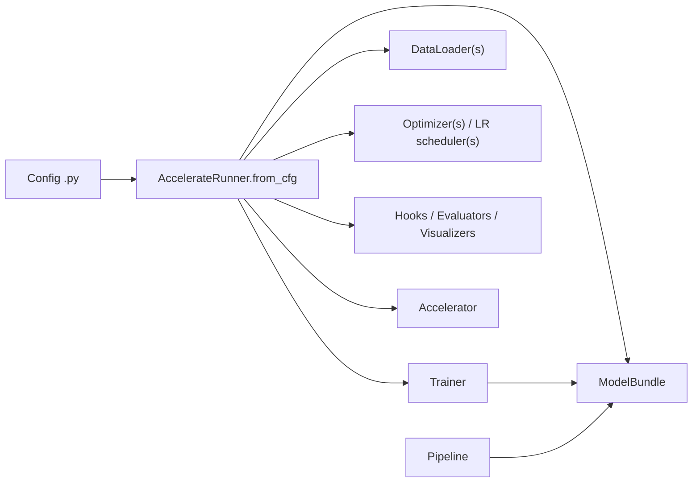
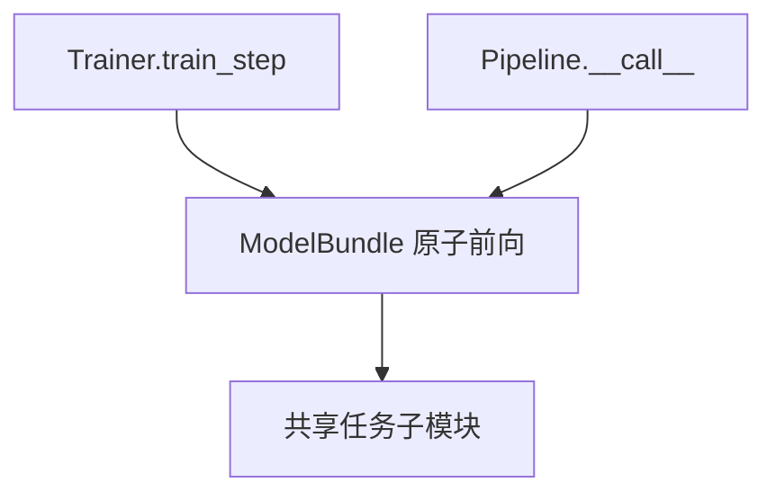

# 架构设计

## 总体流程

## 核心组件

`ModelBundle`

- 持有任务子模块
- 定义训练与推理共享的原子前向函数
- 提供选择性 checkpoint save/load

`Trainer`

- 组装训练图
- 计算 loss
- 在多 optimizer 场景下可接管优化流程

`Pipeline`

- 组织推理阶段控制流
- 复用和训练相同的 bundle 逻辑

`AccelerateRunner`

- 从 config 构建完整实验
- 通过 `accelerate` prepare 可训练模块
- 负责 validation、logging、checkpoint 和 resume

`Hook`

- 是 runner 持有的运行时回调
- 从 `default_hooks` 构建，并按 `priority` 排序
- 适合处理 logging / checkpoint / EMA，不负责任务 loss 或前向逻辑

validation 指标和可视化由 evaluator / visualizer 单独处理。详见 [Hook 系统](design/hooks.md)。

## 训练与推理复用

## 当前已实现的任务栈

- `ViTBundle` + `ClassificationTrainer` + `ClassificationPipeline`
- `SD15Bundle` + `SD15Trainer` + `SD15Pipeline`
- `CausalLMBundle` + `CausalLMTrainer` + `CausalLMPipeline`
- `WanBundle` + `WanTrainer` + `WanPipeline`
- `StyleGAN2Bundle` + `GANTrainer` + `StyleGAN2Pipeline`
- `DMDBundle` + `DMDTrainer` + `DMDPipeline`

GAN 和 DMD 这两条线现在是可运行的参考实现。它们对齐了 StyleGAN2 和
DMD 的核心训练结构，但默认 config 的目标仍然是验证框架集成，而不是
直接声明 benchmark 级别复现。
