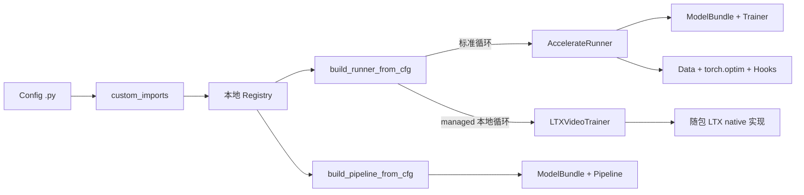
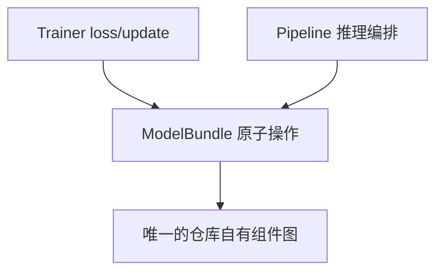

# 架构设计

## 总体流程


```mermaid
flowchart LR
    A["Config .py"] --> B["custom_imports"]
    B --> C["本地 Registry"]
    C --> D["build_runner_from_cfg"]
    D -->|标准循环| E["AccelerateRunner"]
    D -->|managed 本地循环| F["LTXVideoTrainer"]
    E --> G["ModelBundle + Trainer"]
    E --> H["Data + torch.optim + Hooks"]
    F --> I["随包 LTX native 实现"]
    C --> J["build_pipeline_from_cfg"]
    J --> K["ModelBundle + Pipeline"]
```

两条分支执行的都是当前仓库随包代码。managed trainer 表示它拥有一套耦合紧密的
生命周期，不表示从另一个 checkout 或已安装模型包中导入 trainer。

## 分层职责

`ModelBundle`

- 持有一个实现需要的组件；
- 暴露训练与推理共享的原子操作；
- 记录 trainable、dtype、gradient checkpointing 与选择性 checkpoint 策略；
- 加载并导出该实现自有的 artifact schema。

`Trainer`

- 持有 loss、更新顺序和训练专属 validation；
- 通常运行在 `AccelerateRunner` 中；只有当算法的预处理/checkpoint 生命周期无法
  拆开时，才明确声明 managed 本地循环。

`Pipeline`

- 持有推理编排和公共输入输出；
- 调用与训练相同的 bundle 操作，不再构建第二份模型图。

`AccelerateRunner`

- 从 config 构建完整实验；
- 通过 Accelerate prepare 本地模型模块与 `torch.optim` 对象；
- 负责 validation、logging、checkpoint 和 resume。

`Hook`、evaluator 与 visualizer

- hook 处理 logging、checkpoint、EMA 等运行时副作用；
- evaluator 从标准 validation 输出计算指标；
- visualizer 序列化可人工检查的结果。

回调顺序见 [Hook 系统](design/hooks.md)。

## 目录分类规范

目录表达代码所有权；同一个命名空间不能在同一层混合任务名与模型/论文名。

| 命名空间 | 所有权分类轴 | 规范示例 |
| --- | --- | --- |
| `hftrainer/models/` | 具体实现 | `vit`、`llama`、`sd15`、`wan`、`stylegan2`、`dmd`、`ltx_video` |
| `hftrainer/models/<id>/network/` | 模型数学与模型专属原语 | attention block、VAE、tokenizer、scheduler |
| `hftrainer/trainers/` | 实现专属优化逻辑 | `sd15`、`wan`、`stylegan2`、`dmd`、`ltx_video` |
| `hftrainer/pipelines/` | 实现专属推理逻辑 | `sd15`、`wan`、`stylegan2`、`dmd`、`ltx_video` |
| `hftrainer/tasks/` | 真正可复用的任务合约 | `image_classification`、`causal_language_modeling` |
| `hftrainer/datasets/` | 样本/collation 合约 | `image_classification`、`instruction_sft`、`text_to_image`、`text_to_video`、`unconditional_image`、`dmd` |
| `hftrainer/evaluation/` | 可复用指标合约 | `image_classification`、`causal_language_modeling` |
| `configs/` | 用户选择的具体实现 | `vit`、`llama`、`sd15`、`wan`、`stylegan2`、`dmd`、`ltx_video` |

行为属于具体方法时，model、trainer、pipeline 与 config 使用同一个
`implementation_id`。只有逻辑确实可被多个模型族复用时，trainer/pipeline 才放入
`tasks/<task_contract>`。当前 ViT 与 LLaMA 使用可复用 task contract；SD1.5、Wan、
StyleGAN2、DMD 与 LTX 保留实现专属 trainer/pipeline。

每个注册模型组件必须只有一个实现 owner、一次 registry 注册和一个规范 package
export。结构测试会拒绝任务形状的 model 别名，以及从第二套模型层级导出的组件。

## 模型依赖边界

`MODEL_COMPONENTS` 是唯一的组件构建 registry。组件名必须解析到
`hftrainer.models.*` 下的仓库代码；点分类路径与任意 import fallback 会被拒绝。

模型执行边界包括：

- 模型层与前向数学；
- 模型使用的 tokenizer/processor；
- 属于算法行为的采样/噪声 scheduler；
- LoRA 注入、adapter 保存/加载与合并；
- artifact 解析与校验；
- 训练与推理编排。

PyTorch、Accelerate、MMEngine、safetensors、NumPy、Pillow 等通用基础设施仍是
正常依赖，但它们不选择、也不拥有具体模型实现。源码 AST 检查与主动阻断模型包的
新进程 import 测试共同保护这条边界。

LTX 通过 `LTXComponentStore` 遵守同一规则：`LTXVideoBundle` 持有并向所有本地
推理 builder 注入 inference registry；托管 trainer 使用独立且不缓存模型实例的
training registry，并继续注入 validation 与每一个 component loader。这样可训练的
可变模型不会与推理 shell 共享实例，loader 也不能暗中创建另一套模型实现或私有缓存。

## 轻量注册

`import hftrainer` 只创建 registry 与轻量 symbol。具体实现通过 config 中精确的
`custom_imports` 纵向切片注册，或由 `hftrainer.register_all_modules()` 统一注册：

```python
custom_imports = dict(
    imports=[
        'hftrainer.models.ltx_video',
        'hftrainer.trainers.ltx_video',
        'hftrainer.pipelines.ltx_video',
    ],
    allow_failed_imports=False,
)
```

因此缺少支持工具时，只会在构建对应功能时失败；模型 class 解析始终留在本地。

## 训练与推理复用


```mermaid
flowchart TB
    A["Trainer loss/update"] --> B["ModelBundle 原子操作"]
    C["Pipeline 推理编排"] --> B
    B --> D["唯一的仓库自有组件图"]
```

## 已实现任务栈与验证边界

- `ViTBundle` + 可复用图像分类 trainer/pipeline；
- `LlamaBundle` + 可复用因果语言建模 trainer/pipeline；
- `SD15Bundle` + `SD15Trainer` + `SD15Pipeline`；
- `WanBundle` + `WanTrainer` + `WanPipeline`；
- `StyleGAN2Bundle` + `StyleGAN2Trainer` + `StyleGAN2Pipeline`；
- `DMDBundle` + `DMDTrainer` + `DMDPipeline`；
- `LTXVideoBundle` + 本地 managed `LTXVideoTrainer` + `LTXVideoPipeline`。

StyleGAN2 与 DMD 是框架导向的 reference implementation，不直接声明 benchmark
复现。LTX 的 config/合约和 tiny 本地 Gemma 路径已测试，但仓库测试环境未执行
gated 22B 工作流。精确边界见
[LTX-Video 2.5](models/ltx_video_2_5.md)。
