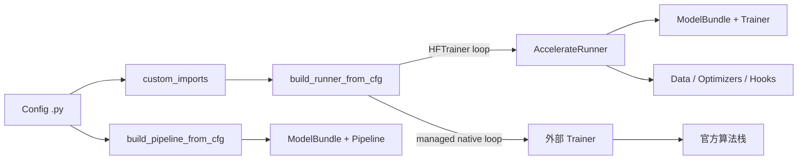
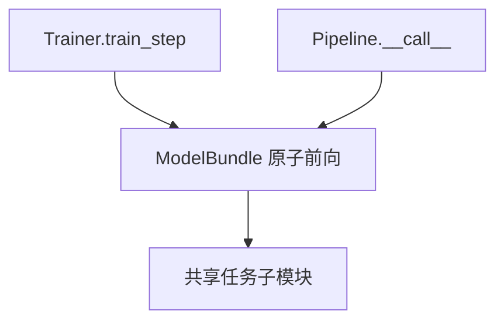

# 架构设计

## 总体流程


```mermaid
flowchart LR
    A["Config .py"] --> B["custom_imports"]
    B --> C["build_runner_from_cfg"]
    C -->|HFTrainer loop| D["AccelerateRunner"]
    C -->|managed native loop| E["外部 Trainer"]
    D --> F["ModelBundle + Trainer"]
    D --> G["Data / Optimizers / Hooks"]
    E --> H["官方算法栈"]
    A --> I["build_pipeline_from_cfg"]
    I --> J["ModelBundle + Pipeline"]
```

## 核心组件

`ModelBundle`

- 持有任务子模块
- 定义训练与推理共享的原子前向函数
- 提供选择性 checkpoint save/load

`Trainer`

- 组装训练图
- 计算 loss
- 在多 optimizer 场景下可接管优化流程

`Pipeline`

- 组织推理阶段控制流
- 复用和训练相同的 bundle 逻辑

`AccelerateRunner`

- 从 config 构建完整实验
- 通过 `accelerate` prepare 可训练模块
- 负责 validation、logging、checkpoint 和 resume

`Managed Trainer`

- 注册 trainer 声明 `manages_training_loop=True` 时由 builder 选择
- 让耦合紧密的上游算法完整持有 Accelerator、optimizer、checkpoint、
  validation 和 resume 行为
- 路径、输出目录、override 和模块注册仍由 HFTrainer config/CLI 统一提供

`Hook`

- 是 runner 持有的运行时回调
- 从 `default_hooks` 构建，并按 `priority` 排序
- 适合处理 logging / checkpoint / EMA，不负责任务 loss 或前向逻辑

validation 指标和可视化由 evaluator / visualizer 单独处理。详见 [Hook 系统](design/hooks.md)。

## 目录分类规范

目录表达代码所有权；不同框架层不需要机械重复同一个名字。每个命名空间使用自己
唯一的分类轴：

| 命名空间 | 分类依据 | 示例 |
|---|---|---|
| `hftrainer/models/` | 具体模型族或算法适配器 | `vit`、`sd15`、`causal_lm`、`wan`、`stylegan2`、`dmd`、`ltx_video` |
| `hftrainer/trainers/` | 可复用训练任务或优化方法 | `classification`、`text2image`、`distillation` |
| `hftrainer/pipelines/` | 推理能力 | `classification`、`text2image`、`text2video` |
| `hftrainer/datasets/` | 样本与 collate 数据契约 | `classification`、`llm`、`text2video` |
| `configs/` | 用户可理解的 workload 或 integration | `classification`、`distillation`、`ltx_video` |

关键约束是同一个命名空间不能并存两套平行分类。每个 `ModelBundle` 在
`models/<implementation_id>/` 下只有一个 canonical owner；不允许再创建任务形状的
model 别名目录。任务级复用应该放在 trainer、pipeline、dataset 和 evaluator 中。

这种区分是有意的。`ClassificationTrainer` 是可复用的分类任务逻辑，不能仅仅因为
当前示例模型是 ViT，就把它归 ViT 私有。相反，`DMDTrainer` 本身就是算法专属的优化
方法，因此放在 `trainers/distillation` 有明确的训练语义。LTX 这类耦合紧密的可选
上游栈可以在 model、trainer、pipeline 三层统一使用 integration ID，因为这些组件
共享同一组依赖和生命周期边界。

因此每个注册模型类必须满足：

1. 只有一个实现模块；
2. 只有一个 registry decorator；
3. 只有一个 canonical package-level export。

结构回归测试会拒绝重新引入任务别名，或让 package export 指向第二套 model 层级。

## 轻量注册

`import hftrainer` 只创建 registry 和轻量 public symbol，不会立即导入所有任务、
Accelerate、Transformers、Diffusers 或 LTX 可选包。需要全部内置任务的应用可以调用
`hftrainer.register_all_modules()`；普通 config 应只声明当前纵向模块：

```python
custom_imports = dict(
    imports=['hftrainer.models.ltx_video', 'hftrainer.pipelines.ltx_video'],
    allow_failed_imports=False,
)
```

这样可选依赖才是真正可选的，缺少依赖的异常也只会在构建对应功能时出现。

## 训练与推理复用


```mermaid
flowchart TB
    A["Trainer.train_step"] --> B["ModelBundle 原子前向"]
    C["Pipeline.__call__"] --> B
    B --> D["共享任务子模块"]
```

## 当前已实现的任务栈

- `ViTBundle` + `ClassificationTrainer` + `ClassificationPipeline`
- `SD15Bundle` + `SD15Trainer` + `SD15Pipeline`
- `CausalLMBundle` + `CausalLMTrainer` + `CausalLMPipeline`
- `WanBundle` + `WanTrainer` + `WanPipeline`
- `StyleGAN2Bundle` + `GANTrainer` + `StyleGAN2Pipeline`
- `DMDBundle` + `DMDTrainer` + `DMDPipeline`
- `LTXVideoBundle` + `LTXVideoPipeline`，以及委托给固定官方 LTX 栈的
  managed `LTXVideoTrainer`

GAN 和 DMD 这两条线现在是可运行的参考实现。它们对齐了 StyleGAN2 和
DMD 的核心训练结构，但默认 config 的目标仍然是验证框架集成，而不是
直接声明 benchmark 级别复现。

LTX 集成已经完成 config/API 合约测试，但仓库测试环境没有加载完整 22B 权重实跑。
精确验证边界见 [LTX-Video 2.5](models/ltx_video_2_5.md)。
