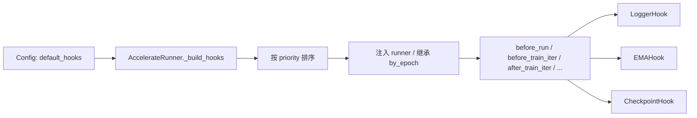

# Hook 系统

HF-Trainer 的 hook 是由 runner 持有的运行时回调，负责处理各种副作用。它不是写任务前向逻辑、loss 定义或优化顺序的地方。

## 职责边界

- `Trainer` 负责 `train_step`、loss 组装和优化行为。
- `Hook` 负责 logging、checkpoint、EMA 状态维护这类副作用。
- `Evaluator` 和 `Visualizer` 只在 validation 阶段运行，消费 `val_step()` 的输出；它们不是 hook。

## Hook 在系统中的位置



## 生命周期

Runner 会在固定时机调用 hook 方法：

| 回调 | 调用时机 | 说明 |
| --- | --- | --- |
| `before_run` | 训练开始前一次 | 初始化状态 |
| `before_train_epoch` | 每个 epoch 开始前 | 只在 `train_cfg.by_epoch=True` 时触发 |
| `before_train_iter` | 每个训练 iter 前 | iter-based 和 epoch-based 都会触发 |
| `after_train_iter` | 每个训练 iter 后 | iter-based 和 epoch-based 都会触发 |
| `after_train_epoch` | 每个 epoch 结束后 | 只在 `train_cfg.by_epoch=True` 时触发 |
| `after_run` | 训练结束后一次 | `CheckpointHook.save_last` 会用到这个阶段 |

## Priority 与执行顺序

Hook 会按 `priority` 升序排序，数值越小越早执行。

当前内置 hook：

| Hook | Priority | 默认启用 | 作用 |
| --- | --- | --- | --- |
| `LoggerHook` | `10` | 是 | 打印训练标量和学习率 |
| `EMAHook` | `15` | 否 | 维护可训练模块的 EMA 副本 |
| `LRSchedulerHook` | `20` | 否 | 兼容占位 |
| `CheckpointHook` | `80` | 是 | 保存周期 checkpoint 和最终 checkpoint |

默认 runtime config 下，实际顺序是：

1. `LoggerHook`
2. `CheckpointHook`

如果你额外开启 `EMAHook`，它会插在 logging 和 checkpoint 之间。

## 内置 Hook 语义

### `LoggerHook`

- 在每个 iter 后读取训练输出。
- 当 `by_epoch=None` 时，会自动继承 `train_cfg` 里的 `by_epoch`。
- 会读取 runner 持有的 scheduler 学习率，并通过 `accelerator.log(...)` 写标量。

### `CheckpointHook`

- 调用 `runner.save_checkpoint()`。
- 通过 `bundle.state_dict_to_save()` 保存选择性的模型权重。
- 通过 `accelerator.save_state(...)` 保存 optimizer / scheduler / RNG state。
- `save_last=True` 会在 `after_run` 再做一次最终保存。

### `EMAHook`

- 维护 `ema_bundle`，也就是一份冻结的、按 EMA 更新的 bundle 副本。
- 在 `after_train_iter` 中按 `update_interval` 更新。
- 重要：runner 现在还不会自动把 EMA 权重切到 validation 或 inference。`EMAHook` 当前只是维护状态，不会自动接管验证路径。

### `LRSchedulerHook`

- 这个 hook 只是为了兼容 MMEngine 风格配置而保留。
- 学习率调度实际已经由 `AccelerateRunner` 在优化步骤里直接推进。
- 实际使用中通常不需要手动加这个 hook。

## 配置方式

默认 runtime config：

```python
default_hooks = dict(
    logger=dict(
        type='LoggerHook',
        interval=10,
    ),
    checkpoint=dict(
        type='CheckpointHook',
        interval=1000,
        max_keep_ckpts=3,
        save_last=True,
    ),
)
```

可选的 EMA：

```python
default_hooks = dict(
    logger=dict(type='LoggerHook', interval=10),
    ema=dict(type='EMAHook', decay=0.9999, update_interval=1),
    checkpoint=dict(type='CheckpointHook', interval=1000, max_keep_ckpts=3),
)
```

一般不需要手动在 hook 上设置 `by_epoch`。当 `by_epoch=None` 时，runner 会自动继承 `train_cfg.by_epoch`。

## 常见困惑

- `default_hooks` 在 config 里虽然是 dict，但运行时顺序不是按 key 顺序，而是按 `priority`。
- Validation 不是 hook。HF-Trainer 的流程是 runner 调 `val()`，然后 evaluator 算指标，再由 visualizer 做展示。
- 多 optimizer 任务的优化顺序仍然由 trainer 负责，hook 不负责控制对抗训练或蒸馏的更新顺序。
