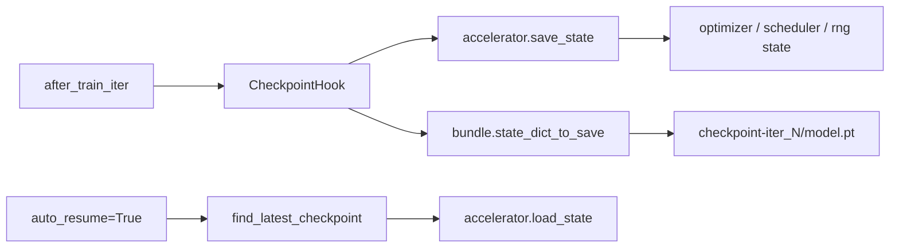

# 实验目录

每次运行会写两类产物：

- 带时间戳的 run 目录，用于日志和 config dump
- 实验根目录下的 checkpoint 目录

## 目录结构

```text
work_dirs/{experiment}/
├── 20260310_204813/
│   ├── config.py
│   └── train.log
├── checkpoint-iter_1/
│   ├── model.pt
│   ├── model.safetensors
│   ├── optimizer.bin
│   ├── scheduler.bin
│   ├── random_states_0.pkl
│   └── meta.pt
└── checkpoint-iter_2/
```

## 语义

- `checkpoint-iter_N` 表示已经完成了 `N` 次 optimizer step。
- `checkpoint-epoch_N` 表示已经完整完成了 `N` 个 epoch。
- `meta.pt` 中的 `global_step` 和 `current_epoch` 采用相同的“已完成计数”语义，因此 resume 会从下一步继续，而不是重复最后一步。

## 自动恢复

```python
auto_resume = True
```

Runner 会扫描 `work_dir` 中最新的 checkpoint，加载完整 accelerator state，然后继续训练。

## 保存 / 恢复流程


