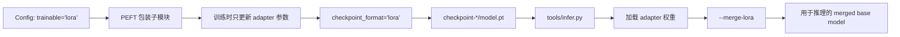

# LoRA

HF-Trainer 支持按子模块配置的 LoRA。

## 配置方式

在任意一个被 PEFT 支持的 bundle 子模块上使用 `trainable='lora'`：

```python
model = dict(
    type='CausalLMBundle',
    model=dict(
        type='AutoModelForCausalLM',
        from_pretrained=dict(
            pretrained_model_name_or_path='checkpoints/TinyLlama-1.1B-Chat-v1.0',
            torch_dtype='auto',
        ),
        trainable='lora',
        checkpoint_format='lora',  # 可选；LoRA 模块默认就是这个
        lora_cfg=dict(
            task_type='CAUSAL_LM',
            r=16,
            lora_alpha=32,
            lora_dropout=0.05,
            target_modules='all-linear',
        ),
    ),
)
```

LoRA 模块支持两种 checkpoint 保存格式：

- `checkpoint_format='lora'`：只保存 adapter 权重
- `checkpoint_format='full'`：保存完整的 LoRA 包装模块 state dict

当 `trainable='lora'` 时，HF-Trainer 默认使用 `checkpoint_format='lora'`。

## 推荐示例

当前可直接运行的参考 config：

- `configs/llm/llama_lora_demo.py`

训练命令：

```bash
python3 tools/train.py configs/llm/llama_lora_demo.py
```

## Checkpoint 语义

HF-Trainer 会把 adapter-only 权重写到 `checkpoint-*/model.pt`，同时保存每个模块的 checkpoint format metadata。

对于 LoRA checkpoint，默认情况下 `model.pt` 只包含 adapter 权重，不包含冻结的 base model 权重。这样 checkpoint 更小，`load_scope='model'` 的加载也更快。

`load_scope='model'`：

- 只加载选择性的 bundle 权重

`load_scope='full'`：

- 通过 `accelerator.load_state(...)` 做完整 resume
- 恢复 optimizer / scheduler / RNG state

## 保存 / 加载 / 合并流程



## 推理与合并

推理时可以直接加载 LoRA checkpoint，并在运行前把 adapter 合并进 base weight：

```bash
python3 tools/infer.py \
  --config configs/llm/llama_lora_demo.py \
  --checkpoint work_dirs/llama_lora_smoke/checkpoint-iter_10 \
  --merge-lora \
  --prompt "What is the capital of France?"
```

`--merge-lora` 会在真正执行 pipeline 之前，在内存中把 adapter weight 合并到 base weight。

## 适用范围

HF-Trainer 在 `ModelBundle` 层暴露 LoRA，因此不同任务的配置模式是一致的。但是否能真正使用，仍然取决于 PEFT 是否支持对应模型类型，以及你配置的 `target_modules` 是否正确。

当前已经做过端到端验证的 LoRA 路径是 Causal LM。
