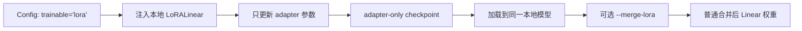

# LoRA

HFTrainer 在 `hftrainer.models.lora` 中本地实现 LoRA。它把 `LoRALinear` 注入
仓库自有模型的 `torch.nn.Linear`，不导入、也不要求安装其他 adapter 框架。

## 配置方式

在 bundle 子模块上设置 `trainable='lora'`，并填写本地 LoRA 参数：

```python
model = dict(
    type='LlamaBundle',
    model=dict(
        type='LocalLlamaForCausalLM',
        from_pretrained=dict(
            pretrained_model_name_or_path='checkpoints/TinyLlama-1.1B-Chat-v1.0',
            torch_dtype='auto',
        ),
        trainable='lora',
        checkpoint_format='lora',
        lora_cfg=dict(
            r=16,
            lora_alpha=32,
            lora_dropout=0.05,
            target_modules='all-linear',
            bias='none',
        ),
    ),
)
```

当前本地参数包括：

- `r` 或 `rank`：正数 adapter rank；
- `lora_alpha` 或 `alpha`：残差缩放的分子；
- `lora_dropout` 或 `dropout`：范围为 `[0, 1)` 的输入 dropout；
- `target_modules`：`'all-linear'`、一个限定名后缀，或后缀列表；
- `bias`：`'none'`、`'all'` 或 `'lora_only'`。

为兼容已有 HFTrainer recipe，旧的 `task_type` 字段仍可出现但会被忽略；它不会
选择另一套实现。

## 训练与 checkpoint

可运行配置：

- `configs/llama/llama_lora_demo.py`

```bash
python3 tools/train.py configs/llama/llama_lora_demo.py
```

注入 LoRA 后，base 参数会被冻结，只有匹配到的 adapter 参数和按配置开放的 bias
参与训练。LoRA 子模块默认使用 `checkpoint_format='lora'`，只把 adapter tensor
写入 `checkpoint-*/model.pt`，不会重复保存冻结的 base checkpoint。

只有确实需要整个 LoRA 注入后模块的 state 时，才使用
`checkpoint_format='full'`。

checkpoint 加载范围与 adapter 格式相互独立：

- `load_scope='model'` 只加载 bundle 选择的模型状态；
- `load_scope='full'` 还会通过 runner 恢复 optimizer、scheduler 和 RNG 状态。

## 保存、加载与合并


```mermaid
flowchart LR
    A["Config: trainable='lora'"] --> B["注入本地 LoRALinear"]
    B --> C["只更新 adapter 参数"]
    C --> D["adapter-only checkpoint"]
    D --> E["加载到同一本地模型"]
    E --> F["可选 --merge-lora"]
    F --> G["普通合并后 Linear 权重"]
```

使用保存的 adapter 推理：

```bash
python3 tools/infer.py \
  --config configs/llama/llama_lora_demo.py \
  --checkpoint work_dirs/llama_lora_smoke/checkpoint-iter_10 \
  --merge-lora \
  --prompt "What is the capital of France?"
```

`--merge-lora` 会在内存中把低秩更新加到 base weight，并在推理前用普通 linear
layer 替换 adapter wrapper。

## 能力边界与失败行为

本地 injector 当前面向 `torch.nn.Linear`。没有 target 命中、重复注入，或 adapter
checkpoint 出现缺失/意外 key 时都会报错，避免静默训练或加载不完整 adapter。

在 HFTrainer 拥有并验证本地 4-bit linear 实现前，QLoRA 会明确拒绝执行。当前请
使用本地 LoRA 或全量微调。
