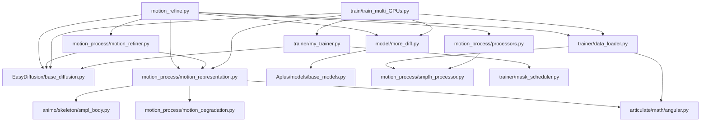

# MoreDiff (MoGenDIT) — Claude 项目说明文档

## 1. 项目概述

### 1.1 核心功能
MoreDiff（Motion Refinement in Diffusion Steps）是一个基于扩散模型的 3D 人体动作修复框架。项目的核心目标是：给定带噪声、抖动或位移异常的 SMPL-H 格式动作捕捉数据（`.npz` 文件），利用扩散模型的去噪能力生成高质量的修复结果。

### 1.2 技术架构
- **扩散模型**：采用高斯扩散（Gaussian Diffusion）+ DDIM 采样，支持 cosine/linear beta 调度
- **网络结构**：MoreDiff — 基于 DiT（Diffusion Transformer）架构，使用 RoPE 位置编码 + 滑动窗口注意力（window_size=90）+ AdaLN 条件融合
- **运动表示**：OccamMotionRep — 将 SMPL-H 数据编码为 `pose(22×6) + joint(22×3) + trans(3) = 201` 维向量，pose 使用 6D 旋转表示
- **训练策略**：多 GPU 分布式训练（DDP），支持 EMA、一致性损失、运动降质增强
- **修复模式**：denoise（去噪）、ada_denoise（自适应去噪）、trans_regen（位移重生成）

### 1.3 模型规模

| 版本 | d_model | n_head | n_stack | 参数量 |
|------|---------|--------|---------|--------|
| `0.03B` | 512 | 8 | 8 | ~0.03B |
| `0.1B` | 768 | 12 | 12 | ~0.1B |
| `0.3B` | 1024 | 16 | 18 | ~0.3B |

---

## 2. 核心功能模块说明

### 2.1 `motion_refine.py` — 动作修复入口

这是项目的命令行入口脚本，负责完整的动作修复流水线：

**主要组件：**
- **`ModelConfigLoader`**：从 `train_args.json` 加载模型配置，查找/匹配模型权重文件
- **`traverse_subfolders(root_dir)`**：递归扫描目录，返回所有包含 `.npz` 文件的文件夹路径列表
- **`refine_motion()`**：核心修复函数（详见 2.3 节）
- **`main()`**：命令行参数解析 → 模型加载 → 逐文件夹批量修复 → 保存结果

**处理流程：**
```
输入目录 → 扫描所有npz子文件夹 → 每个文件夹用NpzMotion.load_data()批量加载
→ 逐文件通过NpzMotion[idx]获取编码motion → refine_motion()修复
→ 拼接手部姿态 → 转npz格式保存（保持原目录结构）
```

### 2.2 `NpzMotion` 类（`trainer/data_loader.py`）

用于加载和处理 `.npz` 格式的 SMPL-H 运动数据，供推理阶段使用。

**`NpzMotion.load_data(data_root, fps=30)` — 静态方法**
- 扫描 `data_root` 下所有 `.npz` 文件
- 对每个文件检查是否包含 `poses` 键，处理可能的 `smpl_data` 嵌套包装
- 调用 `smplh_to_body_motion()` 解析数据（含前向运动学、重采样到指定 fps）
- 将轴角表示转换为旋转矩阵表示：`axis_angle_to_rotation_matrix(pose)`
- 分离身体关节（前22个）和手部关节（22个之后）
- **返回**：`data_dict`，包含字段 `file_name`, `poses`, `joint`, `trans`, `beta`, `hand_pose`, `gender`

**`NpzMotion.__init__(self, data, motion_rep)`**
- `data`：`load_data()` 返回的 `data_dict`
- `motion_rep`：运动表示编码器（通常是 `OccamMotionRep` 实例）

**`NpzMotion.__getitem__(index)` → `(motion, motion_length)`**
- 从预加载的数据中取出 pose/joint/trans
- 调用 `motion_rep.encode()` 编码为运动向量
- 返回 `(motion_tensor, seq_len)`

### 2.3 `refine_motion()` — 核心修复函数

```python
def refine_motion(
    motion: torch.Tensor,      # 编码后的运动向量 (seq_len, data_dim)
    refiner,                    # MoreDiffRefiner 实例
    motion_rep,                 # OccamMotionRep 实例
    device,                     # 计算设备
    denoise_step: int,          # 去噪步数
    mode: str,                  # 修复模式
    fast_sampling: bool = True, # 快速采样
    imputation_mode: str = "skip_last",  # 插补模式
) -> Tuple[pose, joint, trans]:
```

**执行流程：**
1. **归一化**：`motion_rep.normalization(motion)` — 将运动数据面朝统一方向、根关节置于原点
2. **修复**：`refiner.refine(motion, ...)` — 使用扩散模型去噪/重生成
3. **解码**：`motion_rep.decode(gen_motion)` — 将运动向量解码回 pose(旋转矩阵)/joint(3D坐标)/trans(位移)

### 2.4 `AdHocMotionData` 类（`trainer/data_loader.py`）

用于训练阶段的数据加载器，处理 `.pt` 格式的预处理数据。

- `load_data(data_root, min_len=30)`：扫描 `.pt` 文件，验证包含 `pose/joint/trans` 字段
- 支持数据缓存（`data_cache_minlen{N}.npz`）
- `__getitem__`：随机截取 `fix_len=224` 帧片段，编码 + 归一化后返回

---

## 3. 代码结构解析

### 3.1 目录结构

```
MoGenDIT/
├── motion_refine.py              # 推理入口：命令行动作修复脚本
├── EasyDiffusion/                # 扩散模型核心实现
│   ├── __init__.py               # 导出 GaussianDiffusion, BetaSchedule, ModelMeanType
│   ├── base_diffusion.py         # 扩散过程：q_sample, p_sample, ddim_sample, denoise
│   └── resample.py               # 训练时间步采样策略
├── model/                        # 神经网络模型
│   ├── more_diff.py              # MoreDiff DiT模型 + get_MoreDiff_model() 工厂函数
│   ├── my_model.py               # 其他模型定义
│   ├── rotation2xyz.py           # 旋转到关节坐标转换
│   └── smpl.py                   # SMPL模型封装
├── motion_process/               # 运动数据处理
│   ├── motion_representation.py  # 运动表示类：OccamMotionRep, Motion291Rep, HM263XRep
│   ├── motion_refiner.py         # MoreDiffRefiner 修复器（窗口化处理、三种修复模式）
│   ├── smplh_processor.py        # SMPL-H数据处理：smplh_to_body_motion()
│   ├── processors.py             # Npz2VecProcessor 格式转换
│   ├── motion_degradation.py     # 运动降质（训练增强）
│   ├── rotation_conversions.py   # 旋转表示转换函数
│   └── utils.py                  # 工具函数（ego_gv、重采样等）
├── trainer/                      # 训练相关
│   ├── data_loader.py            # 数据集类：AdHocMotionData, NpzMotion
│   ├── my_trainer.py             # MoGenDitDistributedTrainer 分布式训练器
│   ├── mask_scheduler.py         # MotionMaskScheduler 训练mask策略
│   ├── geometric_loss.py         # 几何一致性损失
│   ├── load_args.py              # TrainArgs 配置加载
│   └── train_platforms.py        # Tensorboard 日志平台
├── train/                        # 训练脚本和配置
│   ├── train_multi_GPUs.py       # 多GPU训练入口
│   └── train_args_*.json         # 训练配置文件（0-9号实验）
├── Aplus/                        # 通用工具库
│   ├── models/                   # 基础模型类(BaseModel)、Transformer、LSTM等
│   ├── runner/                   # 训练器基类(DistributedLMTrainer)
│   └── utils/                    # 检查点、日志、指标管理
├── animo/                        # 骨骼动画库
│   ├── skeleton/                 # SMPL骨骼定义(AnimoSMPLBody)
│   └── visualizer/               # Web可视化工具
├── articulate/                   # 数学/运动学库
│   └── math/                     # angular(旋转转换)、spatial(空间变换)
├── MotionDB/                     # Flask动作数据管理Web系统
├── MotionLab/                    # 运动数据处理工具（SMPL权重、body_model等）
└── utils/                        # 全局工具（种子固定、下载脚本等）
```

### 3.2 模块依赖关系



### 3.3 数据流

**推理（motion_refine.py）**：
```
.npz文件 → smplh_to_body_motion() → axis_angle→rotation_matrix
→ NpzMotion.load_data() → data_dict
→ NpzMotion[idx] → motion_rep.encode() → motion向量(seq_len, 201)
→ motion_rep.normalization() → 归一化motion
→ refiner.refine() → 扩散去噪/重生成 → 修复后的motion
→ motion_rep.decode() → (pose, joint, trans)
→ 拼接hand_pose → Npz2VecProcessor.motion2npz_dict() → 保存.npz
```

**训练（train_multi_GPUs.py）**：
```
.pt文件 → AdHocMotionData → 随机截取fix_len帧 → encode+normalize
→ MotionMaskScheduler生成mask → 可选motion_degradation降质
→ GaussianDiffusion.q_sample()前向加噪 → MoreDiff模型预测x0
→ 计算loss(pose/joint/trans/vel/consistency) → 反向传播 → EMA更新
```

---

## 4. API 接口文档

### 4.1 `OccamMotionRep`（当前使用的运动表示）

```python
class OccamMotionRep:
    def __init__(self, keep_hand=False, global_pose=True, fps=30)
```
- `keep_hand`：目前仅支持 `False`
- `global_pose`：是否使用全局姿态（影响编码时是否执行 forward_kinematics）
- `data_dim`：`201`（22×6 + 22×3 + 3）

**关键属性（mask）**：
- `pose_mask`：bool tensor, `[0:132]` 为 True，22个关节×6D旋转
- `joint_mask`：bool tensor, `[132:198]` 为 True，22个关节×3D坐标（局部坐标，相对根关节）
- `trans_mask`：bool tensor, `[198:201]` 为 True，根关节3D全局位移

**主要方法**：

| 方法 | 输入 | 输出 | 说明 |
|------|------|------|------|
| `encode(pose, joint, trans)` | `pose(T,22,3,3)`, `joint(T,22,3)`, `trans(T,3)` | `motion(T, 201)` | 编码：旋转矩阵→6D，可选FK，拼接 |
| `encode_batch(pose, joint, trans)` | 增加 batch 维度 `(B,T,...)` | `(B, T, 201)` | 批量编码 |
| `decode(motion)` | `motion(T, 201)` | `(pose(T,22,3,3), joint(T,22,3), trans(T,3))` | 解码：6D→旋转矩阵，可选IK |
| `normalization(motion, ref_idx=0)` | `motion(T, 201)` | `motion(T, 201)` | 朝向归一化，根关节xz置原点 |
| `pre_stitch(motion, ref_motion, ...)` | 当前motion + 参考帧 | `motion(T, 201)` | 窗口间缝合对齐 |
| `motion_degradation_batch(motion, ...)` | `(B, T, 201)` | `(B, T, 201)` | 训练时运动降质增强 |
| `get_component(motion, name)` | motion tensor, `"pose"/"joint"/"trans"` | 对应分量 | 按名称提取分量 |

### 4.2 `MoreDiffRefiner`（`motion_process/motion_refiner.py`）

```python
class MoreDiffRefiner:
    def __init__(self, motion_rep, model, diffusion)
```

**核心方法 `refine()`**：

```python
def refine(
    self, motion, cond, step=10, eta=1.0, early_stop=None,
    imputation_mode="skip_last", mode="denoise",
    window_size=224, prev_padding=20, use_windowed=False,
    fast_sampling=True,
) -> torch.Tensor
```

- `motion`：归一化后的运动张量 `(1, seq_len, 201)`
- `cond`：条件输入（当前为 `None`）
- `mode`：修复模式
  - `"denoise"`：调用 `_denoise_mode()` → `diffusion.denoise()`，对噪声数据直接去噪
  - `"trans_regen"`：调用 `_regen_mode()` → `diffusion.ddim_sample_loop()`，从纯噪声重生成位移分量（pose/joint作为条件保持）
  - `"ada_denoise"`：两阶段自适应 — 先 denoise 发现高变化区域，再针对性修复
- `use_windowed`：是否启用窗口化处理（长序列必须启用），window_size=224帧，overlap=20帧
- `fast_sampling`：仅对 `trans_regen` 模式生效，使用10步自定义时间步 `[999,750,500,250,100,50,25,10,5,0]` 替代完整1000步
- `imputation_mode`：`"skip_last"` / `"all"` / `"none"`

### 4.3 `GaussianDiffusion`（`EasyDiffusion/base_diffusion.py`）

```python
class GaussianDiffusion:
    def __init__(
        self, num_timesteps=1000,
        beta_schedule=BetaSchedule.COSINE,
        model_mean_type=ModelMeanType.START_X,
    )
```

**关键方法**：

| 方法 | 用途 | 说明 |
|------|------|------|
| `q_sample(x0, t, noise, obs_mask, length_mask)` | 前向加噪 | 训练时使用，支持 obs_mask 保护关键帧 |
| `denoise(x_wrap, model, num_timesteps, eta, mask, imputation_mode)` | 部分去噪 | 从指定步数的噪声中恢复，用于 denoise 模式 |
| `ddim_sample_loop(x_wrap, model, ..., custom_timesteps, imputation_mode)` | 完整DDIM采样 | 从纯噪声生成，用于 trans_regen 模式 |
| `ddim_sample(model, x_wrap, t, eta, prev_t)` | 单步DDIM | 内部调用 |

### 4.4 `MoreDiff` 模型（`model/more_diff.py`）

```python
model = get_MoreDiff_model(data_dim=201, version="0.1B")
```

**模型输入**（通过 `wrap_inputs` 封装）：
- `x_t`：`(batch, seq_len, data_dim)` — 当前噪声运动数据
- `cond`：`(batch, 1, 66)` — 条件特征（22×3 关节坐标），可为 None（自动置零）
- `mask`：`(batch, seq_len, data_dim)` — 已知区域标记（1=已知/保持）
- `padding_mask`：`(batch, seq_len)` — 填充标记（1=填充位置）

**模型输出**：`(batch, seq_len, data_dim)` — 预测的 x₀（去噪后的运动数据）

### 4.5 `NpzMotion`（`trainer/data_loader.py`）

```python
# 加载数据
data_dict = NpzMotion.load_data(data_root="./data/input", fps=30)
# 创建数据集
dataset = NpzMotion(data=data_dict, motion_rep=motion_rep)
# 获取样本
motion, length = dataset[0]  # motion: (seq_len, 201), length: int
```

### 4.6 `Npz2VecProcessor`（`motion_process/processors.py`）

```python
mp = Npz2VecProcessor(keep_hand=False)
out_npz = mp.motion2npz_dict(
    pose=pose_tensor,    # (T, n_joint, 3, 3) 旋转矩阵
    trans=trans_tensor,   # (T, 3)
    frame_rate=30,
    betas=beta_tensor,
    gender="neutral",
)
np.savez("output.npz", **out_npz)
```

---

## 5. 配置参数详解

### 5.1 推理参数（`motion_refine.py` 命令行）

| 参数 | 类型 | 默认值 | 说明 |
|------|------|--------|------|
| `--ckpt-dir` | str | 必需 | 模型检查点根目录，如 `./save/ckpt` |
| `--model-name` | str | 必需 | 模型名称，如 `MoreDiff-0.1B`，对应 `ckpt-dir` 下的子目录 |
| `--input-dir` | str | 必需 | 输入 npz 数据目录（递归扫描所有子目录） |
| `--output-root` | str | 必需 | 输出根目录，实际输出到 `<output-root>/<input-dir-name>_<model-name>_<mode>_<step>` |
| `--step` | int | None | 指定模型训练步数，None 则使用最新模型 |
| `--use-ema` | flag | False | 使用 EMA 模型权重 |
| `--denoise-step` | int | 10 | 去噪步数（影响修复强度） |
| `--mode` | str | `denoise` | 修复模式：`denoise`/`ada_denoise`/`trans_regen` |
| `--fast-sampling` | flag | True | 快速采样（仅 trans_regen 生效），10步自定义时间步 |
| `--no-fast-sampling` | flag | - | 禁用快速采样，使用完整1000步DDIM |
| `--imputation-mode` | str | `skip_last` | 插补模式（见下表） |
| `--global-pose` | bool | None | 覆盖 train_args.json 中的 global_pose 设置 |
| `--keep-hand` | flag | False | 保留手部姿态 |
| `--device` | str | `cuda:0` | 计算设备 |
| `--skip-existing` | flag | False | 跳过已存在的输出文件 |

### 5.2 imputation_mode 详解

在扩散采样的每一步中，imputation 操作会将已知区域（mask=True）的值强制恢复为原始输入值，确保这些区域不被扩散过程修改。

| 模式 | 行为 | 适用场景 |
|------|------|----------|
| `skip_last` | 每步执行 imputation，但最后一步跳过 | **默认推荐**。避免最后一步的硬替换导致边界不连续 |
| `all` | 每步都执行 imputation，包括最后一步 | 严格保持已知区域不变（如 trans_regen 中的 pose/joint） |
| `none` | 完全不执行 imputation | 调试用途，让模型完全自由生成 |

### 5.3 训练配置（`train_args_*.json`）

标准训练配置 `train_args_2.json`：

| 参数 | 值 | 说明 |
|------|-----|------|
| `model_name` | `MoreDiff-0.1B` | 模型名称/保存目录名 |
| `model_version` | `0.1B` | 模型规模版本 |
| `batch_size` | 128 | 每GPU batch大小 |
| `lr` | 1e-4 | 学习率 |
| `weight_decay` | 1e-4 | 权重衰减 |
| `save_interval` | 40000 | 保存间隔（步数，自动除以GPU数） |
| `global_pose` | true | 使用全局姿态表示 |
| `motion_degradation` | true | 启用运动降质增强 |
| `degrade_rate` | 0.5 | 降质数据比例 |
| `consis_loss` | true | 启用运动学一致性损失 |
| `consis_start_step` | 10000 | 一致性损失开始步数 |
| `ema_decay` | 0.999 | EMA衰减率 |
| `ema_start_step` | 1000 | EMA开始步数 |
| `train_data` | `["academic", "amass"]` | 训练数据集列表 |
| `l1_weight_x0` / `l2_weight_x0` | 1.0 / 0.0 | x₀预测的L1/L2损失权重 |

### 5.4 训练mask模式（keyframe_modes）

训练时使用的 mask 策略（在 `train/train_multi_GPUs.py` 中配置）：

| 模式 | 比例 | 说明 |
|------|------|------|
| `random_frame` | 20% | 随机帧观测（5%-10%帧率） |
| `random_phrase` | 20% | 随机片段观测 |
| `random_start_end` | 20% | 保持起止帧，中间50%-90%缺失 |
| `block_trans` | 10% | 位移分量全部遮蔽 |
| `joint_only` | 10% | 仅保留关节位置 |
| `uncond` | 20% | 无条件（全部遮蔽） |

---

## 6. 开发指南

### 6.1 添加新的修复模式

1. 在 `motion_process/motion_refiner.py` 的 `MoreDiffRefiner` 中：
   - 添加新的私有方法 `_new_mode()`
   - 在 `_non_windowed_refine()` 中添加新模式的分支
   - 在 `refine()` 的 `valid_modes` 列表中注册
   - 在窗口化处理逻辑中配置新模式的 mask 策略

2. 在 `motion_refine.py` 中：
   - 更新 `--mode` 参数的 `choices` 列表

### 6.2 添加新的运动表示

1. 在 `motion_process/motion_representation.py` 中创建新类
2. 必须实现以下接口：
   - `encode(pose, joint, ...)` → motion tensor
   - `decode(motion)` → (pose, joint, ...)
   - `normalization(motion)` → normalized motion
   - `pre_stitch(motion, ref_motion, ...)` → stitched motion（如需窗口化修复）
   - `data_dim` 属性
   - `pose_mask`, `joint_mask`, `trans_mask` 属性（bool tensor）
3. 相应修改训练脚本和推理脚本中的实例化代码

### 6.3 添加新的训练数据集

1. 使用 MoreDiff-Data 仓库中的处理脚本将原始数据转换为 `.pt` 格式
2. `.pt` 文件必须包含字段：`pose`(T, n_joint, 3, 3)、`joint`(T, n_joint, 3)、`trans`(T, 3)
3. 在 `train/train_multi_GPUs.py` 的 `dataset_paths` 中注册新数据集路径
4. 在训练配置的 `train_data` 列表中添加数据集名称

### 6.4 性能优化注意事项

- **数据加载**：`NpzMotion.load_data()` 在推理时一次性加载整个文件夹的数据到内存，避免逐文件重复读取
- **NpzMotion 复用**：每个文件夹只创建一次 `NpzMotion` 实例，避免重复实例化
- **GPU内存**：窗口化处理（window_size=224）控制单次推理的序列长度
- **快速采样**：`fast_sampling=True` 将 trans_regen 的采样从1000步减至10步
- **DataLoader**：训练时使用 `num_workers=4`、`pin_memory=True` 加速数据加载
- **向量化操作**：优先使用 PyTorch 向量化操作（如 `torch.cumsum`）替代循环

### 6.5 模型检查点结构

```
save/ckpt/<model_name>/
├── train_args.json              # 训练配置副本（训练开始时自动拷贝）
├── model_0000010000.pth         # 常规模型权重
├── model_0000020000.pth
├── ema_model_0000010000.pth     # EMA模型权重
└── ema_model_0000020000.pth
```

---

## 7. 故障排除

### 7.1 常见问题

| 问题 | 原因 | 解决方案 |
|------|------|----------|
| `FileNotFoundError: No .npz files found` | 输入目录下没有 npz 文件 | 检查 `--input-dir` 路径是否正确 |
| `'poses' key not found` | npz 文件格式不符合 SMPL-H 规范 | 确保 npz 包含 `poses` 字段 |
| `CUDA out of memory` | 序列过长或batch_size过大 | 使用窗口化处理（`use_windowed=True`，默认已启用） |
| `模型目录不存在` | model_name 与 ckpt-dir 下的目录不匹配 | 检查可用模型：`ls <ckpt-dir>/` |
| `未找到步数为 N 的模型` | 指定的 step 不存在 | 不指定 `--step` 使用最新模型，或检查可用步数 |
| `DataLoader worker CUDA error` | worker 进程中使用了 CUDA 操作 | 确保 `__getitem__` 中所有操作在 CPU 上完成 |
| 修复结果出现位移跳变 | 窗口切换处缝合失败 | 检查 `pre_stitch()` 的对齐逻辑 |

### 7.2 调试技巧

- **查看模型配置**：读取 `save/ckpt/<model_name>/train_args.json` 确认 `global_pose`、`model_version` 等参数
- **跳过已处理文件**：使用 `--skip-existing` 断点续传
- **错误日志**：处理失败的文件记录在 `<output_dir>/error_log.txt`
- **Tensorboard 监控训练**：`tensorboard --logdir save/log/<model_name>`
- **关键训练指标**：
  - `wa-mpjpe`：加权平均关节位置误差（cm）
  - `wa-mpjae`：加权平均关节角度误差（度）
  - `loss_consis`：运动学一致性损失
  - `grad_norm`：梯度范数（应稳定在合理范围内）

### 7.3 数据格式要求

**输入 npz 文件必须包含的字段**：
- `poses`：SMPL-H 姿态参数，轴角表示，`(T, n_joints×3)` 或 `(T, n_joints, 3)`
- `trans`：根关节平移，`(T, 3)`
- `betas`：体型参数，`(16,)` 或 `(10,)`
- `gender`：性别字符串，`"male"/"female"/"neutral"`
- `mocap_frame_rate` 或 `mocap_framerate`：原始帧率

可选的嵌套格式：数据可能包装在 `smpl_data` 键下。
